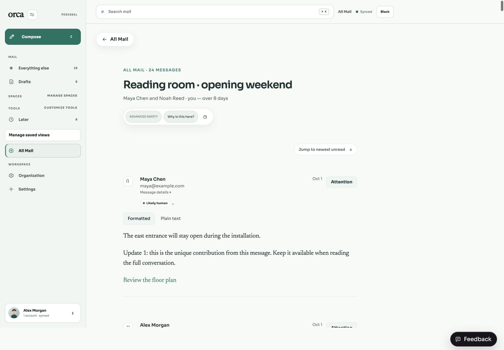
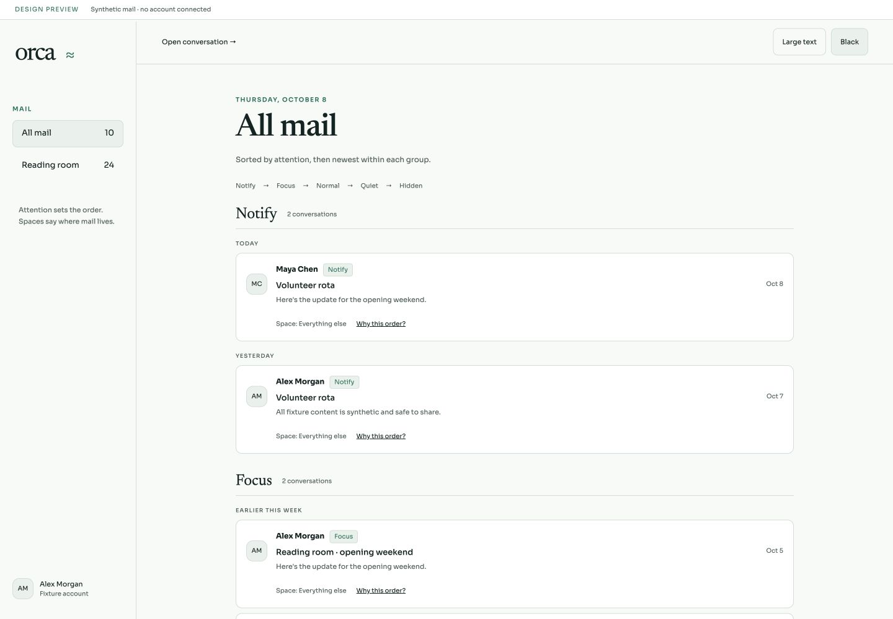
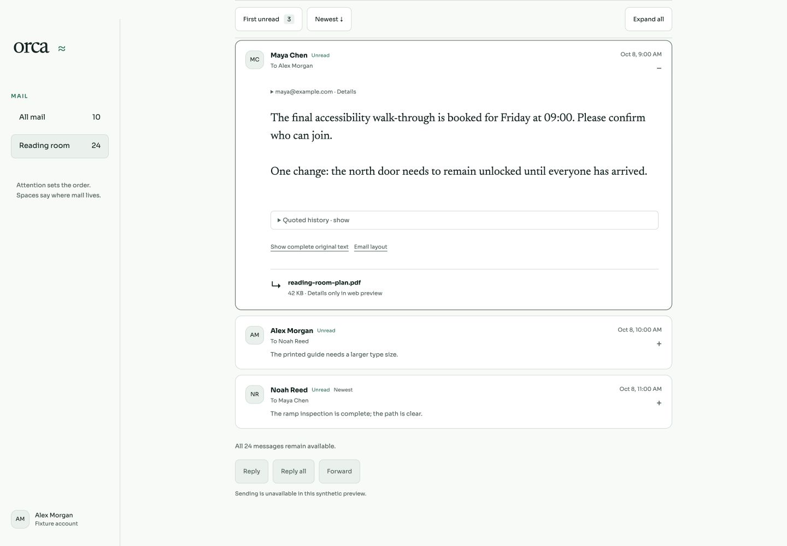
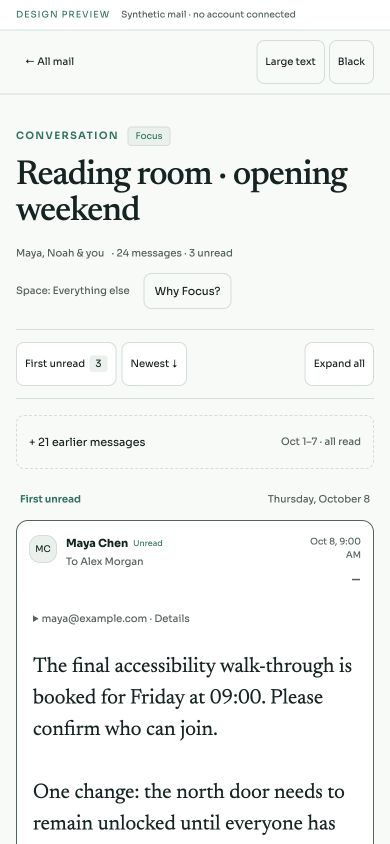
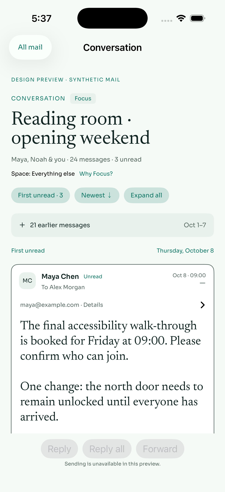
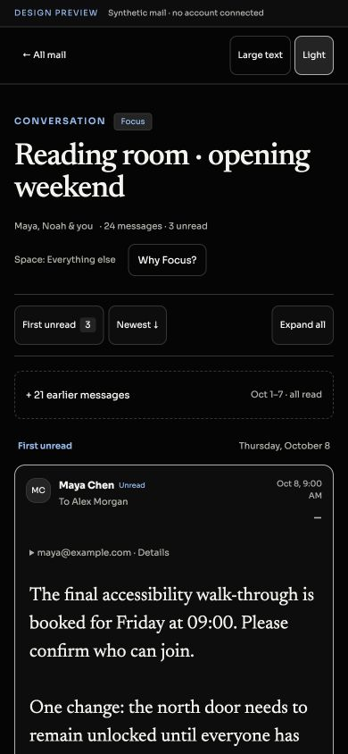
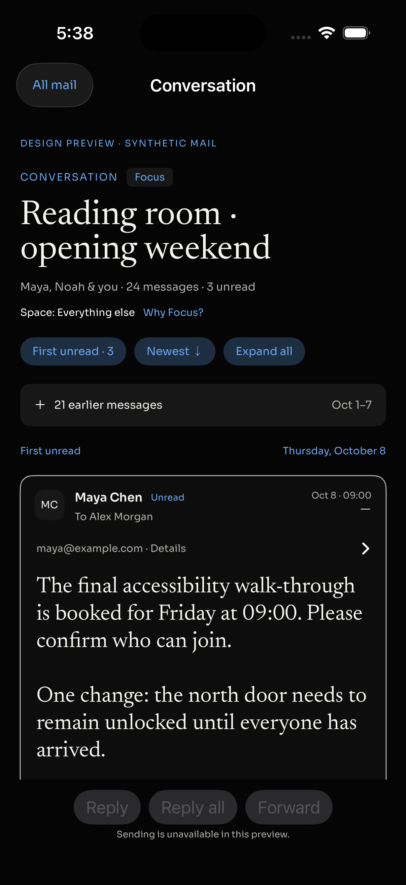

# Attention and long-thread reader — stage 1

Design review only. These standalone web and SwiftUI prototypes use synthetic mail; no production UI, priority semantics, accounts, database, read flags, signing, or release configuration changed. Review this direction before a separate production implementation.

## The problem and measured baseline

At baseline commit `f0a9180a8a185cd2bdb293d87a617e81414ebbaf`, the actual web App rendered a synthetic 24-message conversation with all 24 bodies expanded. At a 1440 × 1000 viewport the reader was 25,852.87 pixels tall and began at the oldest message. The inbox had ten attention badges, all hidden by CSS; five previews displayed encoded apostrophes. An older Focus group consequently looked like an unexplained reversal of date order above Normal mail from today.



The baseline runs the unchanged production web App against `baseline-server.ts`, a loopback-only fixture server with no provider or database. Sync and read requests are acknowledged as no-ops. Other writes are rejected. The original user Library screenshot could not be materialized because access failed; it was not pixel-inspected and is not reproduced in these artifacts.

Source evidence: `apps/web/src/styles.css` hides `.attention-badge` and `.message-unread-dot`; `App.tsx` renders date sections and all thread bodies. Web and API sorting already use Notify → Focus → Normal → Quiet → Hidden. `reader-body.ts` can place a unique inline answer following a quote marker into collapsed quoted history. Native `ThreadView.swift` renders full message bodies and automatically marks read when loading; that live-account path was not exercised.

## Proposed direction

Keep the existing five-state attention order, with dates nested inside each group. An older Focus conversation remains ahead of newer Normal mail, but both groups are visibly named. Show **Space: Everything else** separately from attention. A “Why” disclosure explains the current attention value and honestly says when winning-rule provenance is unavailable; destination does not imply priority or rule provenance.



The conversation opens at the first unread message, or the latest message when all are read. Earlier messages remain available behind a disclosure. Message cards retain sender, time, recipients, preview, and unread/newest labels. First unread, Newest, and Expand all controls support navigation. No action changes fixture unread flags.

Only a conservative trailing block of quote-prefixed lines folds in the prototype. A unique unquoted answer after a quote marker keeps the entire body visible. The complete original text toggle is lossless, including whitespace; HTML remains separately available. The prototype defaults to text, unlike the current production HTML-first reader. This is a design choice to review, not proven production renderer parity.



| Mobile web | Native SwiftUI |
| --- | --- |
|  |  |
|  |  |

## Platform scope and safety boundaries

- Web: standalone React prototype, desktop and mobile entry points, both themes, all-read and enlarged-text states. It makes no account/API calls. Its HTML is fixed trusted synthetic fixture content; its direct HTML insertion must not become a production rendering path. Production sanitization and link protections must be retained during integration.
- Native: separate SwiftUI preview app and bundle identifier, using the repository's unchanged `OrcaTheme` and `SafeHTMLView`. The latter retains disabled JavaScript, nonpersistent storage, CSP, and external-link scheme restrictions. Actual native reader screenshots were captured in both themes.
- Attachments retain fixture metadata; downloading and sending are deliberately unavailable. This does not verify real attachment authorization or delivery. Production integration must preserve those paths.
- `native-inbox-light.png` predates the final source refinement to date grouping and row contrast. It is historical evidence, not a final native inbox acceptance screenshot. Native Dynamic Type, VoiceOver jump focus, interactive links/attachments, and complete control-state parity remain review/implementation checks. Native jump currently scrolls without explicitly transferring VoiceOver focus.

## Validation and independent review

`bun test docs/ixd/attention-thread-reader/contracts.test.ts`: **5 pass, 44 assertions**. Covers wire-valid 24-message fixture, priority/date order, first unread/latest/empty selection without read mutation, lossless quote splitting including CRLF and inline answers, and bounded text entity decoding.

`baseline-regressions.check.ts` records **four expected failures** on the captured production baseline: hidden attention labels, encoded preview text, fully expanded thread, and inline answers placed in quoted history. Three checks consume saved DOM measurements; they are baseline evidence, not a live regression suite. Production implementation needs fresh integrated regressions.

Browser interactions verified before the connection dropped: first unread initially opens message 22, complete original text matches the fixture, HTML layout preserves fixture link hrefs, Expand all opens 24 messages, unique inline answer stays in current text, Newest focuses message 24, and First unread focuses message 22. All-read opens message 24 with the unread control disabled; mobile large-text view had no horizontal overflow. Final keyboard outline verification was interrupted and remains unverified.

An independent design/code review found no blocking issue for a design-only draft PR. Its all-read selection bug and unrelated-row navigation findings were corrected. Its native VoiceOver-focus limitation remains open; native date grouping and all-read date caption were corrected in source, without a final native recapture after the connection interruption.

## Reproduce locally

From the repository root with locked dependencies installed:

```bash
# Terminal 1: synthetic baseline API only
bun docs/ixd/attention-thread-reader/baseline-server.ts
# Terminal 2: unchanged production web UI on http://127.0.0.1:4320
bunx vite --config docs/ixd/attention-thread-reader/vite.config.ts
# Terminal 3: review prototype, served from repository root
bunx vite --host 127.0.0.1 --port 4321 --strictPort
```

Open `/docs/ixd/attention-thread-reader/desktop.html` or `mobile.html` on port 4321. Append `?read=all` for an all-read conversation. The toolbar switches theme and text size. The inbox is accessible through All mail; only Reading room has an implemented fixture conversation.

On an Apple Silicon Mac with Xcode, `bash docs/ixd/attention-thread-reader/native/build.sh /tmp/orca-reader-preview` builds a separate simulator app. Install it only on a dedicated test simulator. Launch arguments: `--dark`, `--inbox`, `--large`, and `--allread`. This is not the production app or a release archive.

## Review gate

Approve or adjust the attention hierarchy, provenance disclosure, initial reader position, card density, and text/HTML presentation before production changes. Production work must cover both web and iOS, retain existing security/attachment behavior, avoid introducing automatic read mutations in validation, add live component regressions, and complete native accessibility verification. This draft is not merge or release approval.
