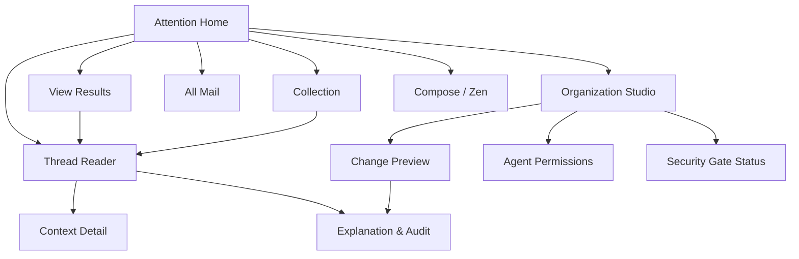

# Orca Organization System — Information Architecture

## Page Inventory

| ID | Page name | Module | Level | Platform | Page type | Entry source | Description |
|---|---|---|---|---|---|---|---|
| P01 | Attention Home | Mail | L1 | Web | Workspace | App launch | Primary lane and thread stream |
| P02 | All Mail | Mail | L1 | Web | List | Sidebar | Canonical recovery surface |
| P03 | Thread Reader | Mail | L2 | Web | Detail | Thread row | Full thread, reply, organization, and explanation entry |
| P04 | View Results | Organization | L1 | Web | List | Sidebar / pin | Live query over threads, facets, contexts, and accounts |
| P05 | Collection | Organization | L1 | Web | List | Sidebar / pin | Curated thread membership |
| P06 | Context Detail | Organization | L2 | Web | Detail | Thread / search | Thin project, customer, order, or user-defined context |
| P07 | Organization Studio | Organization | L1 | Web | Workspace | Sidebar / command | Manage lanes, Views, Collections, facets, contexts, and rules |
| P08 | Change Preview | Organization | L2 | Web | Wizard | Agent proposal / rule edit | Historical simulation, examples, conflicts, risks, and approval |
| P09 | Explanation & Audit | Trust | L2 | Web | Side Panel | Thread / change | Winning rule, precedence trace, actor, history, and undo |
| P10 | Agent Permissions | Trust | L2 | Web | Settings | Settings / MCP connect | Account and command scopes, expiry, confirmation policy |
| P11 | Security Gate Status | Trust | L2 | Web | Result | Organization Studio | Blocking audit and capability readiness status |
| P12 | Compose / Zen | Writing | L1 | Web | Overlay | Write / reply | Existing human-authored outbound experience |

## Sitemap

## Navigation Structure

- The responsive sidebar or bottom navigation contains the current primary lane, All Mail, user-pinned Views and Collections, Write, and Settings.
- User-created lanes and Views replace fixed Human/Tideline classification tabs.
- Organization Studio is the single manual control surface for all organizational structures.
- Thread Reader remains immersive. Organization and explanation open as side panels so the reading context is preserved.
- Pins only reference durable objects; they do not embed serialized UI state.

## Global Interaction Inventory

- **Thread Row**: primary lane, workflow state, facets, context links, winning-rule indicator.
- **Organization Inspector**: editable lane, workflow state, facets, contexts, manual lock.
- **Why This Is Here Panel**: precedence trace, winning rule, actor, timestamps, correction, undo.
- **Change Set Preview**: historical counts, representative examples, conflicts, risk level, approval.
- **Rule Editor**: Orca source, structured representation, validation, simulation status, activation state.
- **Agent Permission Sheet**: allowed accounts, command types, expiry, and confirmation level.
- **Security Gate Banner**: capability unavailable until its blocking assessment passes.

## Architecture Decision

The UI does not own organizational behavior. The React and MCP adapters cross the same Organization-module seam. That module owns thread aggregation, rule evaluation, precedence, authorization, simulation, transactions, audit, and undo.

## Phase 2 Verification

- Twelve pages cover daily review, organization, agent authority, trust, recovery, and writing.
- Every core feature is reachable within three navigation actions.
- Page hierarchy does not exceed L2 in this MVP scope.
- Status: PASS.
