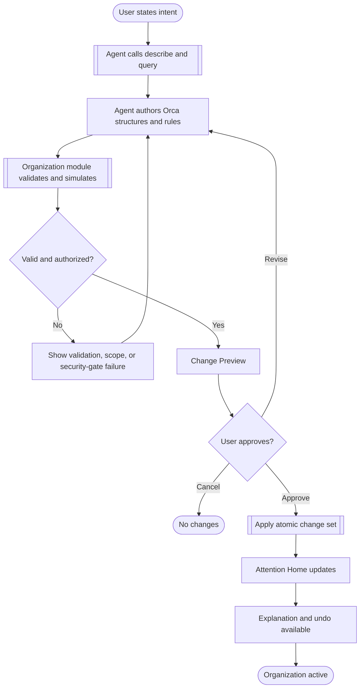
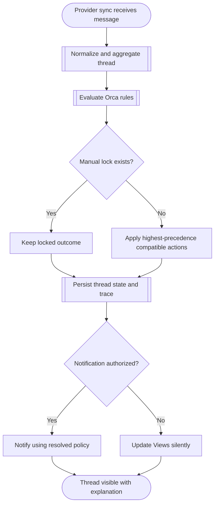
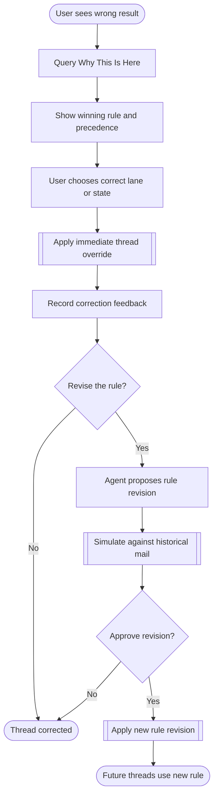

# Orca Organization System — Core User Flows

## Flow 1: Agent Creates an Organization System

| Step | Surface | User or agent action | System response | Exception handling | Target time |
|---|---|---|---|---|---|
| 1 | External agent | User states desired organization | Agent inspects available schema and mail | Missing authority returns required scope | <3s |
| 2 | Agent | Creates proposed structures and rules | Orca validates and simulates historical impact | Invalid language returns located diagnostics | <10s |
| 3 | Change Preview | User reviews samples, conflicts, and risks | Orca exposes complete proposed change set | Blocked security gate prevents approval | Immediate |
| 4 | Change Preview | User approves | Atomic apply creates an audit entry | Revision conflict forces resimulation | <3s |
| 5 | Attention Home | User inspects results | Threads show lane and winning rule | Undo restores the prior revision | <1s |

## Flow 2: New Mail Is Organized

| Step | Surface | Action | System response | Exception handling | Target time |
|---|---|---|---|---|---|
| 1 | Sync | New message arrives | Message is normalized and added to its thread | Provider failure retries without partial organization | Background |
| 2 | Organization module | Evaluate event-condition-action rules | Resolve one primary lane and other compatible actions | Resource limit stops evaluation and uses fallback lane | <1s |
| 3 | Organization module | Persist result | Save winning rule, precedence trace, actor, and revision | Transaction failure leaves prior state intact | <1s |
| 4 | Attention Home | Render thread in matching Views | Show explanation entry and correction controls | Missing View never hides thread from All Mail | <300ms |

## Flow 3: User Corrects a Result

| Step | Surface | User action | System response | Exception handling | Target time |
|---|---|---|---|---|---|
| 1 | Thread / row | Open explanation | Show the exact winning rule and losing candidates | Missing trace is a correctness failure | <300ms |
| 2 | Organization Inspector | Select correct result | Apply manual override immediately | Locked or destructive state requires confirmation | <1s |
| 3 | Explanation & Audit | Request broader fix | Agent proposes, but does not silently edit, the rule | No matching rule leaves only the local correction | <3s |
| 4 | Change Preview | Approve simulated revision | Apply versioned rule and preserve audit history | Concurrent edit forces resimulation | <3s |

## Key Decision Points

### Authority and security gate
- A command must be valid, within the actor's account and action scopes, and behind a completed security gate.
- Failure returns a structured reason and does not partially apply changes.

### Rule precedence
- User safety lock wins over manual override, which wins over rules, lane policy, and workspace fallback.
- Every resolved outcome stores and exposes its complete trace.

### Fallback lane
- Every workspace has one designated fallback lane.
- Deleting a lane requires migrating its threads; deleting the fallback requires selecting a replacement.

### Rule revision
- A thread correction is immediate.
- A responsible rule is shown but never silently rewritten.
- Historical simulation and approval precede a rule revision unless the actor has explicit low-risk automation authority.

## Phase 3 Verification

- Three high-value flows cover initial organization, continuous routing, and correction.
- Each flow includes validation, authorization, transaction, or recovery exceptions.
- All paths end in an applied, corrected, rejected, or unchanged state.
- Status: PASS.
