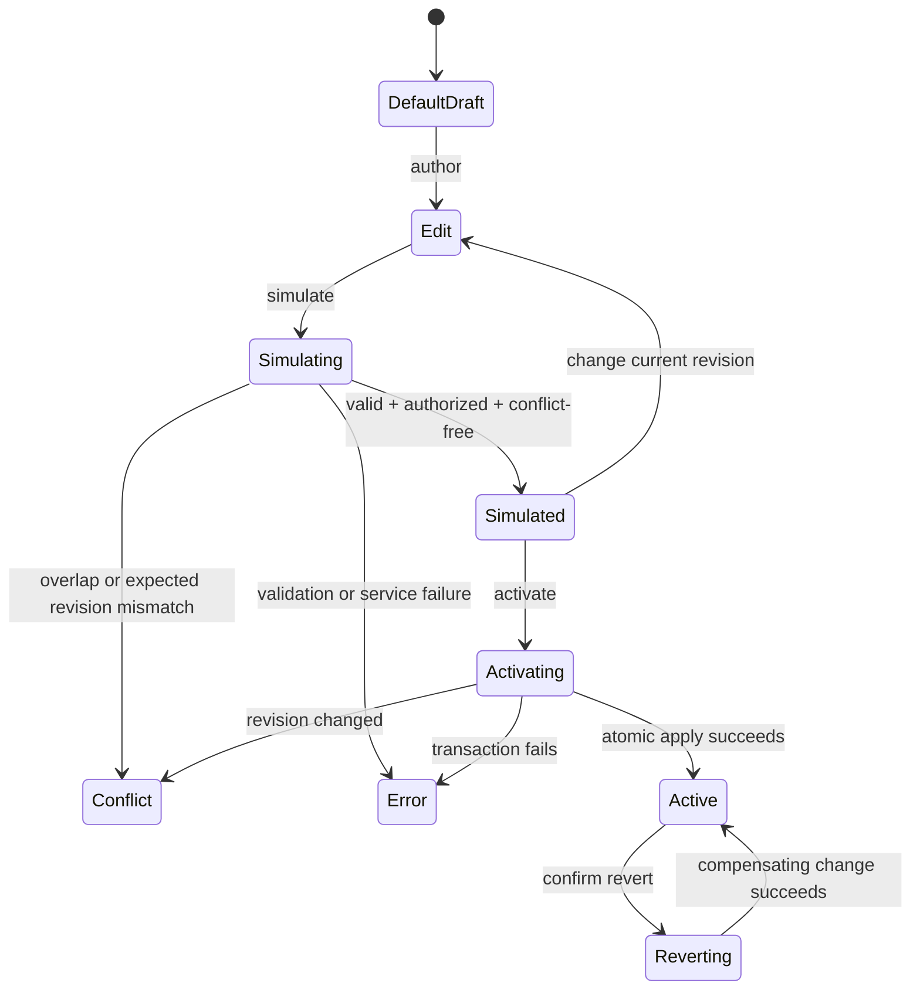

# P07 Organization Studio — Interaction Specification

**Ticket**: BRE-307  
**Scope**: Organization page only. Inbox, reader, composer, and Zen Mode remain unchanged.  
**Status**: Accepted direction for developer handoff after prototype review.

## 1. Page overview

**Function**: The single control surface for discovering, authoring, simulating, activating, explaining, auditing, and reverting Orca rules.  
**Module**: Organization  
**Upstream pages**: Attention Home and All Mail through the existing Organization navigation item; Thread Reader through “Why is this here?” deep links.  
**Downstream surfaces**: Inline simulation results, Trace, audit history, and revert confirmation. These are panels or overlays, not separate navigation destinations.  
**User goal**: Understand what a rule does, safely change it, prove its historical impact, activate one immutable revision, and recover without losing history.

### Direction lock

- **Glass Box is the default** authoring and explanation mode. It exposes the event, predicates, actions, and reason as legible blocks.
- **Tide Table is the deep-edit mode** for minute Orca-language work. Switching modes changes representation, not rule identity or semantics.
- The information hierarchy is: rule discovery → authoring → simulation → activation → Trace → audit history → revert.
- Simulation and live execution use the same semantics. A rule cannot activate from an unsimulated, stale, conflicting, invalid, or unauthorized revision.
- Revert creates a compensating change set. History is never rewritten.

## 2. Layout structure

### Desktop

```text
┌────────────────────────────────────────────────────────────────────┐
│ Existing Orca title bar / window chrome                            │
├──────┬─────────────────────────────────────────────────────────────┤
│      │ Page header: Organization · rule count · search · New rule  │
│ Orca ├──────────────┬──────────────────────────┬───────────────────┤
│ rail │ Rule library │ Authoring workbench      │ Trace + audit     │
│      │ Search       │ Glass Box / Tide Table  │ Precedence        │
│ Org  │ Drafts       │ Rule revision           │ Actor + reason    │
│ sel. │ Active       │ Simulation results      │ Revert            │
│      │ Archived     │ Fixed action bar        │                   │
└──────┴──────────────┴──────────────────────────┴───────────────────┘
```

- The existing Orca rail remains the global navigation source of truth. The selected Organization control keeps a readable label and uses the theme-safe selected treatment.
- The rule library is independently scrollable and preserves the selected rule when filtering.
- The authoring workbench is the focal region. Its mode switch and action bar stay visible while content scrolls.
- Trace and audit remain adjacent to authoring so a user can inspect causality without leaving the edit context.
- At narrow desktop widths, the library collapses first; Trace becomes an inline right drawer. No production content escapes its window container.

### Mobile

```text
┌──────────────────────────────────────┐
│ Existing status area                 │
├──────────────────────────────────────┤
│ Organization + New rule              │
│ Glass Box | Tide Table               │
├──────────────────────────────────────┤
│ Rule discovery picker                │
│ Selected revision                    │
│ Authoring blocks / Tide Table source │
│ Simulation result                    │
│ Trace | Audit history                │
├──────────────────────────────────────┤
│ Simulate | Activate                  │
├──────────────────────────────────────┤
│ Existing Orca bottom navigation      │
└──────────────────────────────────────┘
```

- Mobile uses one scrollable column. Rule discovery becomes a picker; Trace and audit become local tabs below the authoring surface.
- The action bar and existing bottom navigation are separate flex regions. Neither overlays scrollable content.
- Organization is visibly selected and labeled in the existing bottom navigation.

## 3. Component inventory

| ID | Component | Region | Interaction | Key states |
|---|---|---|---|---|
| C01 | Existing Orca navigation | Global chrome | Opens Organization | default, hover, focus, selected |
| C02 | Rule search / picker | Rule discovery | Filters or selects stable rule identity | default, focus, empty, error |
| C03 | Rule row | Rule discovery | Selects a rule without navigation | default, hover, focus, selected, active, draft |
| C04 | New rule | Header | Creates a local draft and focuses title | default, hover, focus |
| C05 | Mode switch | Workbench | Swaps Glass Box and Tide Table representations | default, hover, focus, selected |
| C06 | Glass Box block | Workbench | Opens the appropriate structured editor | default, hover, focus, validation error |
| C07 | Tide Table editor | Workbench | Edits Orca source with located diagnostics | default, focus, dirty, error |
| C08 | Simulation panel | Workbench | Shows counts, representative matches, conflicts, risk, authority | loading, simulated, conflict, error |
| C09 | Simulate action | Action bar | Validates and runs against historical mail | default, hover, focus, loading, disabled |
| C10 | Activate action | Action bar | Applies the current simulated revision atomically | disabled, enabled, loading, active, conflict |
| C11 | Trace | Inspector / inline tab | Shows the complete precedence chain and winner | default, partial, error |
| C12 | Audit history | Inspector / inline tab | Lists append-only actor/revision/change-set events | default, loading, empty, partial, error |
| C13 | Revert action | Audit | Opens confirmation and creates compensating change | default, hover, focus, disabled, loading |
| C14 | Revert dialog | Inline overlay | Confirms or cancels revert | open, focus-trapped, submitting, error |
| C15 | Scenario control | Prototype shell only | Demonstrates required states | default, simulated, active, conflict, error |

## 4. Interaction behaviors

### Rule discovery and selection

- Typing in search filters by rule name, event, action, and status without changing the selected rule.
- Empty search shows “No rules match” plus Clear search. A workspace with no rules shows “Describe what deserves your attention” plus Create first rule.
- Desktop arrow keys move between visible rows; Enter selects. Mobile picker selection updates the workbench in place.
- A selected row uses `--orca-surface-hover`, `--orca-border`, and `--orca-ink`; selected text never relies on inverse color assumptions.

### Glass Box authoring

- Glass Box loads by default and preserves this order: When → If → Then → Because.
- Selecting a block opens only that block’s structured fields. Edits create a dirty draft; the last successful simulation becomes stale immediately.
- Each block exposes human copy and its typed semantic projection. Decorative connector lines are not interactive.
- “Because” is required for activated rules because it becomes the human-readable Trace reason.

### Tide Table deep editing

- Tide Table opens the same revision and serializes the same rule. No copy or conversion step is required.
- Located diagnostics connect a line and column to the corresponding Glass Box block.
- Switching back to Glass Box is allowed only when source parses. Invalid source stays preserved in Tide Table and names the blocking diagnostic.
- Desktop shortcut: Command/Control + Enter simulates. Command/Control + Shift + Enter activates only when activation is enabled. Escape closes the current overlay.

### Simulation

- Simulate validates syntax, types, authority, expected revision, and resource limits before evaluating historical mail.
- Results show total threads evaluated, affected count, notification count, hidden count, representative examples, conflicts, risk, and required authority.
- Simulation never mutates mail or organization state.
- Any edit after simulation marks results stale and disables Activate.

### Activation

- Activate is disabled until the current revision has a successful, conflict-free, current simulation and required authority.
- Activation performs one revision-checked atomic change set. Duplicate submission reuses the idempotency key.
- Success updates revision status, writes audit history, refreshes Trace, and announces the outcome through an accessible status region.
- Revision conflict does not auto-merge. It returns to conflict state and requires refresh, review, and resimulation.

### Trace, audit, and revert

- Trace always lists the precedence strata in order: Safety Lock → Manual Override → winning Rule → Lane Policy → Workspace/Fallback.
- Every winner names rule identity, revision, priority, actor, reason, and evaluated snapshot.
- Audit entries are append-only and ordered newest first. Selecting an entry may compare immutable revisions but never rewrites them.
- Revert opens a focused confirmation that states scope and expected effect. Confirm creates a compensating change set, then re-evaluates affected threads.

### Disabled behavior

- Disabled controls remain fully labeled and use theme-safe control, border, and muted text tokens.
- Hover and click do not fire. A nearby sentence explains why activation is disabled; no disabled control relies on a tooltip alone.

## 5. State machine

| State | Trigger | Visual treatment | Available actions |
|---|---|---|---|
| Default draft | Rule selected, current revision not simulated | Glass Box default; Activate disabled | Edit, switch mode, simulate |
| Loading | Rule, simulation, Trace, or audit request pending | Local skeleton/progress in the affected region | Cancel safe requests, navigate back |
| Empty | No rules or no audit events | Specific empty explanation and CTA | Create rule or return |
| Error | Load, parse, simulation, apply, or revert fails | Located inline error; draft retained | Retry, edit, cancel |
| No access | Actor lacks scope or security gate | Required capability and requesting actor shown | Request scope, inspect read-only |
| Partial | Rule loads but Trace or audit fails | Authoring remains usable; failed panel names staleness | Retry failed panel |
| Edit | Glass Box field or Tide Table changes | Dirty marker; prior simulation stale | Save draft, simulate, cancel |
| Simulated | Current revision passes historical simulation | Impact summary and representative sample visible | Activate, inspect Trace, edit |
| Active | Atomic apply succeeds | Active status and new audit entry | Inspect, clone, revert |
| Conflict | Overlap, stale revision, or precedence conflict found | Conflict summary with losing/winning candidate | Resolve, refresh, resimulate |



## 6. Motion specifications

- Page entry and mode changes use `--orca-motion-medium` with `--orca-ease-enter`.
- Hover and focus feedback use `--orca-motion-fast`.
- Simulation result enters with a restrained opacity and vertical-offset transition; counts do not animate numerically.
- Activation and revert update only affected regions; the entire application does not celebrate or flash.
- Reduced-motion mode removes transforms and uses immediate opacity/state changes.

## 7. Data loading strategy

- First load requests rule summaries, selected rule revision, active rule-set revision, and compact audit cursor in parallel.
- Rule library and audit history use cursor pagination. Trace loads for the selected rule or selected representative thread.
- Draft authoring is optimistic locally but never marks simulated or active until the server confirms.
- Simulation is keyed by rule revision, workspace snapshot, account scope, and evaluation-engine version.
- Return navigation restores selected rule, authoring mode, scroll position, and unsaved Tide Table text.
- Offline mode permits inspection of cached rules and local draft edits; simulate, activate, and revert remain disabled with an explanation.

## 8. Adaptation, theme, and accessibility

### Responsive behavior

| Width | Layout |
|---|---|
| under 760px | Mobile single column; picker; local Trace/Audit tabs; fixed flex action region |
| 760px–1023px | Rule library drawer; workbench full width; Trace inline drawer |
| 1024px–1279px | Library + workbench; Trace collapsible |
| 1280px and above | Library + workbench + persistent Trace/audit inspector |

- Desktop minimum review viewport: 1024px × 680px. Prototype baseline: 1280px × 800px.
- Mobile prototype baseline: 390px × 844px; critical actions meet a 44px target.
- This is a responsive web surface, not a separate desktop-client window. Multi-window behavior is not introduced by BRE-307.

### Themes

- All states map to established `--orca-*` variables.
- Default, hover, focus, selected, disabled, simulated, active, conflict, and error states are verified in light and dark themes.
- Selected controls use surface, border, and ink tokens; labels remain visible in both themes.
- Error and warning color supplements a text label and icon; color is never the only signal.

### Accessibility

- DOM order follows visual order: navigation → discovery → authoring → simulation → Trace → audit → actions.
- Desktop supports complete Tab/Shift+Tab navigation; dialogs trap focus and restore it on close.
- Mode and detail switches expose `aria-pressed` or `aria-selected`; status updates use a polite live region, errors use alerts.
- Touch targets are at least 44px; desktop controls are at least 32px.
- Contrast target is WCAG AA. Reduced motion follows the existing Orca preference and system media query.

## 9. Interaction walkthrough

| Dimension | Passed / total | Result | Notes |
|---|---:|---|---|
| Basic interactions | 5 / 5 | Pass | Feedback, validation, confirmation, reversibility, discoverability covered |
| Page states | 4 / 4 | Pass | Includes cached/offline, restoration, progress, partial failure |
| Navigation and flow | 4 / 4 | Pass | Local panels preserve context and draft |
| Forms and input | 4 / 4 | Pass | Draft retention and located errors specified |
| Data loading | 4 / 4 | Pass | Cursor, freshness key, caching, and local failure boundaries specified |
| Content display | 4 / 4 | Pass | Long copy, empty, unloaded, and sample fallbacks specified |
| Visual and brand | 5 / 5 | Pass | Orca hierarchy, themes, contrast, and restrained color retained |
| Touch and click | 3 / 3 | Pass | Target size and spacing specified |
| Desktop-exclusive | 10 / 10 | Pass | Keyboard, hover, focus, context, resize, drag non-applicability, and tooltips resolved |
| Cross-platform consistency | 4 / 4 | Pass | Equivalent operations with platform-native layouts |
| **Overall** | **47 / 47** | **Pass** | No P0 or P1 interaction-spec gaps |

## 10. Micro-interaction specifications

### Simulation completion

1. Trigger: historical simulation completes.
2. Visual change: result region appears; status moves from “Simulating” to “Simulated”; Activate becomes enabled only when conflict-free.
3. Motion: `--orca-motion-medium` and `--orca-ease-enter`; no count-up animation.
4. Feedback: light haptic on mobile only when user initiated; no desktop sound.
5. Reversal: any edit immediately marks the result stale and disables Activate.

### Activation

1. Trigger: user activates a current simulated revision.
2. Visual change: button enters loading, then status reads Active; a new audit row and Trace winner appear.
3. Motion: affected regions crossfade using Orca content-transition tokens.
4. Feedback: accessible status announcement; no decorative celebration.
5. Reversal: Revert creates a new compensating audit event; it does not animate history backward.

### Safe revert

1. Trigger: user selects Revert and confirms scope.
2. Visual change: modal closes after confirmation; active revision and audit update atomically.
3. Motion: dialog uses existing Orca overlay entry/exit tokens.
4. Feedback: light mobile haptic after success; no destructive sound.
5. Reversal: the compensating change is itself revertible through a later audited action.
