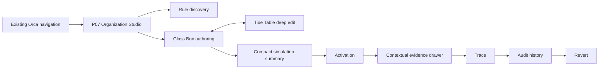

# Orca Organization Page — Interaction Design and Developer Handoff

**Ticket**: BRE-307  
**Version**: 1.3
**Date**: 2026-08-23  
**Status**: Desktop product direction explicitly approved
**Target platforms**: Desktop web; mobile is deferred to a separate rebranding milestone
**Implementation gate**: Open. The user explicitly approved the contextual evidence drawer, colorful whiteboard-like Glass Box, compact simulation, mobile deferral, and malleable shell split. Dispatch reviews remain the technical and accessibility evidence baseline, not the source of product approval.

## Revision history

| Version | Date | Author | Change |
|---|---|---|---|
| 1.0 | 2026-08-23 | Codex | Focused BRE-307 direction, interaction spec, dual prototype, and handoff |
| 1.1 | 2026-08-23 | Codex | Technical/accessibility review 44 resolved 6/6 findings at commit `5f6e251`; product direction remained pending |
| 1.2 | 2026-08-23 | Luke + Codex | User-led direction review: contextual evidence drawer, diagrammatic Glass Box, compact simulation, mobile deferral, and malleable application-shell follow-up |
| 1.3 | 2026-08-23 | Luke + Codex | Explicitly approved the colorful whiteboard/Scratch-like Glass Box and opened the desktop implementation gate |

## 1. Design overview

### 1.1 Background

Orca is moving from Human-versus-Automated navigation toward a programmable attention workspace. The Organization page is the human control plane for that system. It must make agent- and user-authored rules understandable, previewable, explainable, and reversible without turning Orca into a developer console.

### 1.2 Goals

1. Give every user a calm path from discovery to safe activation.
2. Make causality and precedence legible before power is granted.
3. Preserve a deep language-level editor for technical users without forcing it on everyone.
4. Keep one semantic rule identity across human and source representations.
5. Keep every applied change auditable and reversible.

### 1.3 Principles

- Glass Box first; Tide Table on demand.
- Preview before power.
- Same engine for historical simulation and live execution.
- Keep the complete winning trace available contextually without making it permanent page chrome.
- Revert with a compensating change; never rewrite history.
- Existing Orca navigation, typography, motion, and theme variables are authoritative.

### 1.4 Scope and boundaries

BRE-307 covers the desktop P07 Organization Studio and demonstrates the approved application-shell direction only. It does not redesign the inbox, reader, composer, Zen Mode, lanes, Views, Collections, or thread presentation. Redesigning those remaining screens is tracked as a dedicated child issue. It creates no production route or backend behavior; it locks the interaction direction for later M8 implementation.

### 1.5 Platform strategy

- Desktop is the approved spatial baseline because authoring benefits from persistent rule discovery and a wide causal canvas.
- Trace and audit are hidden by default, open in a contextual right drawer, and may be pinned on wide screens with the preference remembered.
- The existing mobile artifact is exploratory only and is not part of this direction approval. Mobile will receive a complete rebranding pass in its next milestone.
- Mobile parity must not be inferred from this desktop handoff.

### 1.6 References

- [User direction review](user-direction-review.html) — the explicit product-approval record for the five desktop decisions.
- Orca’s current inbox and settings surfaces for typography, rail/bottom-navigation character, motion, and theme variables.
- Linear for structured, fast workspace interaction.
- Notion for user-defined structures without hiding the underlying model.
- Gmail only for recovery expectations such as All Mail, not for visual direction.

### 1.7 Terminology

| Term | Definition |
|---|---|
| Glass Box | Default structured projection of one typed Orca rule revision |
| Tide Table | Minute source-level Orca-language editing mode for the same revision |
| Simulation | Pure historical evaluation with no mutation |
| Trace | Complete ordered explanation of candidates, precedence, winner, actor, and reason |
| Activation | Atomic, revision-checked application of a simulated rule revision |
| Revert | A compensating change set that restores prior behavior without deleting history |

## 2. Information architecture

### 2.1 Scoped structure



### 2.2 Navigation mapping

| Operation | Approved desktop behavior |
|---|---|
| Enter Organization | Stable Organization anchor in the Orca rail |
| Discover rules | Persistent library + search |
| Switch authoring mode | Pill group above workbench |
| Inspect Trace | “Explain outcome” opens the contextual evidence drawer |
| Inspect audit | “History” opens the same drawer at audit history |
| Keep evidence visible | Pin the drawer on wide screens; preference is remembered |
| Simulate / Activate | Workbench action bar with compact inline simulation evidence |
| Arrange workflow spaces | Focus, Signals, Quiet, and Later are user-owned and reorderable; fixed anchors remain stable |

### 2.3 Exhaustiveness statement

The broader M8 architecture contains 12 pages. BRE-307 explicitly locks one control page and its inline panels/overlay. Existing mail, reading, writing, and other organization pages are excluded to prevent accidental redesign.

## 3. User flows

### 3.1 Author and activate

1. User selects or creates a rule.
2. Glass Box explains the current revision.
3. User edits structured blocks or opens Tide Table.
4. Orca validates and simulates against historical mail.
5. User inspects counts, examples, conflicts, risk, authority, and Trace.
6. A current, conflict-free simulation enables Activate.
7. Activate creates one atomic change set and an audit entry.

### 3.2 Explain and correct

1. Thread deep link opens the responsible rule and Trace.
2. Trace shows Safety Lock, Manual Override, winning Rule, Lane Policy, and fallback.
3. A thread correction applies locally outside this page.
4. Any broader rule change returns through authoring and simulation; the rule is never silently rewritten.

### 3.3 Revert

1. User selects an audit revision and chooses Revert.
2. Confirmation names scope and compensating behavior.
3. Orca checks actor authority and expected active revision.
4. One compensating change set applies.
5. Trace and audit update; the reverted revision remains inspectable.

### 3.4 Exception rules

- Parse/type/authority/resource failures retain the draft and show a located reason.
- A stale or conflicting revision cannot activate.
- A transaction failure leaves the prior active revision intact.
- Offline mode allows cached inspection and local drafting but disables simulate, activate, and revert.

## 4. Page interaction specification

The complete ten-section implementation specification is [page-P07.md](phase4-page-specs/page-P07.md).

Key locked decisions:

- Glass Box is the initial and default view, rendered as a connected causal diagram with distinct When, If, Then, and Because shapes.
- Tide Table edits the same revision and never becomes a second navigation destination.
- Simulation results live inline with authoring as a compact summary; deeper evidence expands on demand and edits mark it stale.
- Trace and audit remain in the same page context but are hidden by default in a right drawer that can be pinned on wide screens.
- Activate is gated by a current successful simulation and authority.
- Revert is an audited compensating action.
- Selected and disabled control labels remain readable in light and dark themes.

## 5. Component and state handoff

The complete token and component contract is [phase5-components.md](phase5-components.md).

### 5.1 Required business components

1. `RuleLibrary`
2. `AuthoringModeSwitch`
3. `GlassBoxEditor`
4. `TideTableEditor`
5. `SimulationResult`
6. `RuleActionBar`
7. `RuleTrace`
8. `AuditHistory`
9. `RevertDialog`

### 5.2 Suggested React state model

```ts
type RuleWorkbenchState =
  | { kind: "loading" }
  | { kind: "draft"; dirty: boolean }
  | { kind: "simulating"; requestId: string }
  | { kind: "simulated"; simulationId: string; stale: false }
  | { kind: "conflict"; conflicts: RuleConflict[] }
  | { kind: "activating"; simulationId: string }
  | { kind: "active"; revisionId: string; changeSetId: string }
  | { kind: "error"; operation: "load" | "simulate" | "activate" | "revert"; message: string };
```

Do not model activation as independent booleans such as `isLoading`, `isActive`, and `hasError`; illegal combinations become too easy. Derive button gates from the discriminated state plus authority and expected revision.

### 5.3 Suggested module seam

```text
apps/web/src/organization/
├── OrganizationPage.tsx
├── model.ts
├── organization-api.ts
├── components/
│   ├── RuleLibrary.tsx
│   ├── GlassBoxEditor.tsx
│   ├── TideTableEditor.tsx
│   ├── SimulationResult.tsx
│   ├── RuleTrace.tsx
│   └── AuditHistory.tsx
└── *.test.tsx
```

`App.tsx` should own only route entry and existing chrome. Rule semantics, activation gates, Trace projection, and API mapping belong inside this deep Organization module.

## 6. Visual handoff

The complete visual direction is [phase6-visual.md](phase6-visual.md).

- Reuse existing `--orca-*` variables; do not create a second palette.
- Keep the workbench as the focal region.
- Use surface, border, and ink for selected states.
- Use danger/warning only for explicit error/conflict evidence.
- Make Glass Box memorable through connected semantic shapes, not decorative color or dashboard elevation.
- Preserve a wide, calm workbench by keeping the evidence drawer closed until requested.
- Use the existing display face for hierarchy and monospace only inside Tide Table.

## 7. Global interaction standards

### 7.1 Keyboard

| Function | macOS | Windows/Linux |
|---|---|---|
| Simulate current revision | Command + Enter | Control + Enter |
| Activate eligible revision | Command + Shift + Enter | Control + Shift + Enter |
| Close dialog/panel | Escape | Escape |
| Move rule selection | Up / Down | Up / Down |
| Select focused rule | Enter | Enter |

### 7.2 Focus order

With the evidence drawer closed: navigation → rule discovery → mode switch and evidence triggers → authoring diagram/editor → simulation → Simulate → Activate. Opening “Explain outcome” or “History” moves focus into the drawer; Close/Escape restores the invoking trigger. Dialogs trap focus and restore it to Revert on dismissal.

### 7.3 Feedback

- Local progress appears for requests over 300ms.
- Success updates the relevant status, Trace, and audit regions.
- Errors stay next to the failing operation and retain user input.
- No toast is the sole evidence of activation or revert.

### 7.4 Motion and themes

- Reuse Orca motion tokens and reduced-motion behavior.
- Verify every default, hover, focus, selected, disabled, simulated, active, conflict, and error state in both themes.
- A control without a readable label is a release-blocking defect.

## Appendix A. Interactive prototypes

- [Desktop prototype](phase7-prototype-desktop.html)
- [Historical mobile exploration](phase7-prototype-mobile.html) — retained as prior review evidence only; non-authoritative and excluded from approval
- [Prototype contract test](phase7-prototype.test.ts)
- [Visual review report](phase7-review-master.md)
- [Dispatch review round 1](phase8-review-round-1.md)
- [Dispatch review round 2](phase8-review-round-2.md)

Prototype scenario controls demonstrate default, simulated, active, conflict, and error. Hover, focus, selected, and disabled states are native interactive CSS states.

## Appendix B. API/data contract recommendation

The later implementation should expose capability-oriented operations behind the Organization module, for example:

| Operation | Purpose |
|---|---|
| `GET /v1/organization/rules` | Cursor-based discovery summaries |
| `GET /v1/organization/rules/:ruleId` | Stable rule plus selected immutable revision |
| `POST /v1/organization/rules/:ruleId/simulations` | Validate and run pure historical evaluation |
| `POST /v1/organization/rules/:ruleId/activations` | Apply current simulated revision with expected revision and idempotency key |
| `GET /v1/organization/rules/:ruleId/trace` | Complete ordered explanation projection |
| `GET /v1/organization/rules/:ruleId/audit` | Cursor-based append-only history |
| `POST /v1/organization/change-sets/:id/reverts` | Create compensating change set |

Exact route shapes remain an implementation decision, but REST, MCP, provider sync, and background adapters must cross the same Organization interface.

## Appendix C. Acceptance test matrix

| Requirement | Evidence |
|---|---|
| Rule discovery and authoring | Rule library/picker + Glass Box/Tide Table |
| Simulation and activation | Inline impact panel + gated atomic action |
| Trace, audit, revert | Hidden-by-default desktop evidence drawer, wide-screen pinning, and revert dialog |
| Default Glass Box / deep Tide Table | Mode switch behavior and copy |
| Existing Orca visual system | Current variables, typography, navigation character, motion |
| Approved platform | Desktop standalone prototype; mobile explicitly deferred |
| Required states | Scenario control plus interactive CSS states |
| Light/dark | Theme toggle and visual evidence |
| No inbox/reader/composer/Zen redesign | Explicit scope boundary and no production UI changes |

## Appendix D. Review decision

**Decision**: The user explicitly approved all five desktop decisions, including the revised colorful, whiteboard-like Glass Box. The current product-direction authority is [user-direction-review.html](user-direction-review.html). Dispatch reviews remain technical/accessibility evidence and are not the product-approval authority.
**Implementation status**: Open for desktop implementation and further flow sketching. Child issue [BRE-321](https://linear.app/brevoort/issue/BRE-321/redesign-every-remaining-orca-desktop-screen-around-the-new) owns redesigning every other desktop screen around the approved shell direction. Mobile remains excluded for its separate rebranding milestone.
