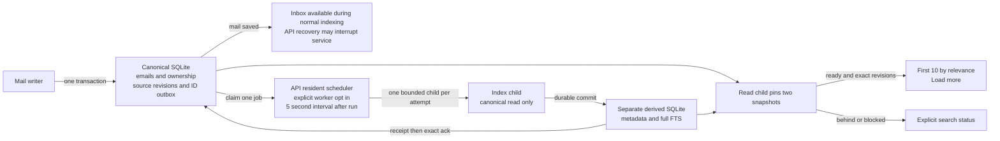
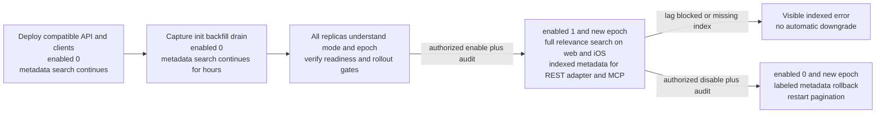
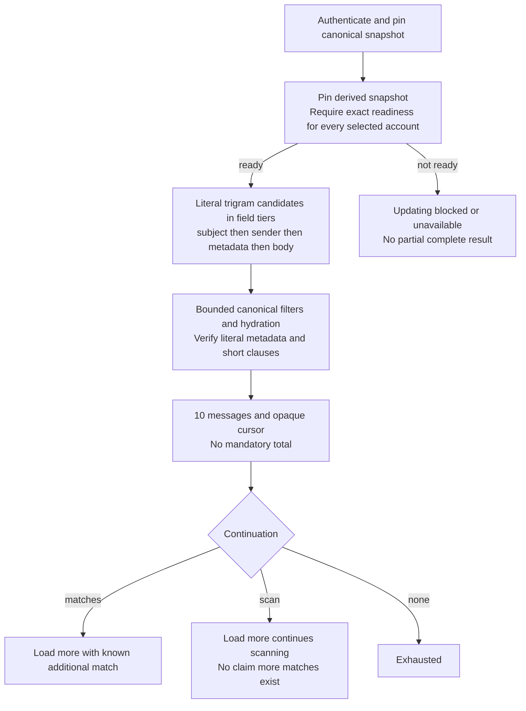

# Orca stored mail search migration

Version 5 staged replacement candidate, public edition | 7 October 2026

Publication reference: [draft PR 228](https://github.com/lukebrevoort/orca/pull/228), initially published at `fb34e0db81169112a82149f8b8eec7c10b21501d` on main `f0a9180a8a185cd2bdb293d87a617e81414ebbaf`. Check the PR for the exact follow-up head and its hosted verification results.
Performance reference: the historical read/count and capture/write figures below predate both staged mode/epoch changes and the provider/idle/count follow-up fixes. They are not measurements of the current code. Current HTTP/capability/auth latency and production measurements remain pending.

## Outcome and current status

Build the derived index while existing metadata-only search continues to work. Before explicit activation, REST and MCP use the original substring reader, including short queries, counts and mailbox order. New web/iOS clients visibly label this metadata-only coverage. After activation, search all mail already stored by Orca with no age cutoff, return the first 10 matches ordered by field relevance, and let the user request more. The public indexed endpoint permits at most 50 messages per page and covers stored sender, subject, snippet and plain-text body. It does not fetch unsynced Gmail mail, search attachments or HTML-only content, correct spelling, or provide semantic/fuzzy matching.

This document describes the actual replacement implementation, not an instruction to migrate production. Document version 5 still uses index format 3 and the `.search-v3.sqlite` suffix. The replacement draft PR and hosted checks remain pending. PR 224 remains frozen at `3bc00823d8e34a30cc382df45422b35fa1910861`. Its incomplete security assessment identified synchronous FTS maintenance inside canonical email transactions as a live-write reliability concern. The replacement moves that work to another file and child process; it does not clear the finding or complete that assessment. No merge, production migration or release is authorized by this plan.



The API process hosts the lightweight scheduler; this is not a new always-on service. It starts a bounded drain only when persisted `worker_enabled=1` and `paused=0`. Startup does not create an index, backfill mail or enable search. Capture triggers always record obligations after migration, including while indexed reads and workers are disabled or paused. Idle supervisors hold no writer lock. There is no external queue broker or search vendor. Short claim/ack writes and shared CPU/disk contention remain.

The follow-up scheduler first performs a read-only advisory probe. Caught-up ticks now avoid owner-token writes, empty claim transactions and seal-cursor updates. Claimed recovery and stale ownership remain visible, and fresh child-side proofs still control readiness. The probe can read delayed queue entries and account modes; it is not a hard constant-time bound. Gmail label/read/category-only persistence also omits unchanged searchable columns while retaining canonical revisions and filter updates, avoiding unnecessary index jobs.

## Staged activation preserves existing search



The authenticated `GET /v1/mail/search/capabilities` endpoint returns version, mode, epoch, owner ID, coverage and semantics. It reads the canonical control row only; it neither scans nor validates the sidecar. A mode of `legacy-metadata` means stored metadata / `legacy-substring-v1`; `indexed` means stored plaintext / `literal-index-v3`. Capability lookup is not a readiness promise: an enabled index may still return updating, blocked or unavailable.

New clients resolve capability before parsing indexed syntax or selecting a text endpoint. Legacy mode uses `/v1/inbox` and the original canonical reader; indexed mode uses `/v1/mail/search`. They send `X-Orca-Expected-Search-Mode` and `X-Orca-Expected-Search-Epoch`, verify matching response headers, and reset results/cursors when mode changes. The API checks expectation before text/cursor parsing and again on execution; the read child requires the captured epoch. Signed indexed and legacy text cursors include activation identity, preventing an enable/disable race from appending results under changed coverage or order. The legacy reader and its mode capture share one canonical snapshot. Original unwrapped legacy cursors are accepted only at initial epoch zero; initialization and later transitions invalidate them.

`init` advances activation epoch, records its fixed initialization reason and leaves indexed readers/workers disabled/paused. Actual `enable` and `disable` transitions advance the epoch and add an audit row containing command, reason, source/build and timestamp; repeated no-op enable/disable commands do not advance it. Enable requires full readiness; disable is a deliberate operator rollback to labeled metadata mode. No persistent first-activation lockout is added; explicit operator rollback remains allowed. Neither lag nor read failure calls disable.

All serving replicas must understand authenticated capabilities, expected-mode/epoch requests and current schemas before enabling. A client can interpret a capability 404 as an old server only after verifying the current authenticated owner and only if that owner/origin has not already been observed in indexed mode during the current client session. Once indexed has been seen, a later 404, network error or 5xx does not downgrade; a successful explicit `legacy-metadata` capability response is required for rollback. Ordinary Inbox/MCP calls without text bypass the search control path entirely.

The indexed transition intentionally changes semantics and cursors: web/iOS gain stored-body literal clauses, field relevance and 10-result pages; REST compatibility text search and MCP stay metadata-only but use indexed literal semantics, relevance and their exact-count path. Short-only queries work before activation and require a longer anchor afterward. Disclose and accept this change before enable. The hours-long backfill estimate is not an outage of existing metadata search; operator crash recovery can still require API/container maintenance as described below.

## Data model and write boundary

The `emails` schema and stored body remain authoritative and unchanged. Migration `0051_queued_mail_search.sql` adds these structures to the canonical database:

| Structure | Stored data and purpose |
| --- | --- |
| `mail_search_control` | Source/build identity, format 3, activation epoch, enabled/worker/paused flags and scheduling cursors |
| `mail_search_activation_audit` | Init/enable/disable command, activation epoch, reason, timestamp and source/build identity |
| `mail_search_accounts` | Account incarnation, independent metadata/full revisions, baseline cursor/completion and deletion state |
| `mail_search_outbox` | IDs, mode, version, operation, build, attempt token/count, retry availability and pending/claimed/blocked state; no body or credential |
| Supporting indexes | Queue scheduling index and `(account_id,id)` baseline index on `emails`; creating that ID index needs migration time on large data |

The derived file holds `index_control` (matching identity and owner token), `index_accounts` (exact published revision, ready flag, mutation token), `index_documents` (immutable document ID, per-mode applied versions, deletion markers, byte sizes), and separate contentless positional trigram `metadata_fts` / `full_fts` tables. An account-incarnation scope key is internal, excluded from user-text columns and ranking. Postings are private derived mail data even though the FTS tables are contentless.

Canonical capture commits mail + source revision + ID/version obligation atomically. Trigger bodies do not tokenize, lowercase, hash, copy, or compare whole bodies. Metadata field updates dirty both modes; body-only updates dirty full mode. Read/star/label-only changes do not rebuild text postings. An identical text update conservatively creates a new revision. Coalescing keeps only the latest obligation for each account/incarnation/message/mode, with fresh attempt state. Queue size follows unique obligations, not a fixed mailbox cap.

The files are not one cross-file transaction. Commit-before-ack and idempotent replay are the recovery protocol. Canonical ownership and mail are the source of truth.

## One job from commit through readiness

```mermaid
sequenceDiagram
  participant API as Mail writer
  participant C as Canonical DB
  participant S as Supervisor
  participant W as Bounded child
  participant D as Derived DB
  API->>C: Commit email + revision 18 + ID job 18
  C-->>API: Saved
  S->>C: Claim exact job, persist attempt token/count
  S->>W: Fixed private request, no credentials
  W->>C: Read-only snapshot, check byte size, copy current source
  W->>D: Check owner/build; clear ready; apply version 18
  D-->>W: Durable commit
  W-->>S: Bounded exact receipt; exit
  S->>C: Ack only matching build/version/attempt after exit
  S->>W: Separate bounded seal attempt
  W->>C: Baseline complete + no jobs + revision R
  W->>D: Same ownership/mutation proof; publish ready at R
```

Source size is checked before loading text. The canonical snapshot closes before expensive tokenization. Each apply checks owner/build identity, updates only absent or newer document/mode state, and clears ready in the same derived transaction as posting changes. Missing applied version is `NULL`, so initial baseline version 0 is real work. Deletion versions prevent older retries from resurrecting mail.

The supervisor waits for the child's exit before acknowledging the receipt. Both acknowledgment and failure updates match the exact build, version, target and attempt token. If version 19 arrives during 18, an old receipt matches no current obligation. Ready publication is separate: baseline complete, zero pending/claimed/delayed/blocked jobs, source revision R, unchanged owner/build/mutation state. A single successful job or empty scheduling probe does not prove readiness.

| Interruption | What survives | Recovery and visible behavior |
| --- | --- | --- |
| Before canonical commit | Neither mail change nor job | Transaction rolls back together |
| After canonical commit | Mail, source revision and latest job | Inbox works; enabled indexed search updates; disabled metadata search continues |
| Child dies before index commit | Job; partial index transaction rolls back | Confirm exit, persisted backoff, bounded retry |
| Index committed before missing ack | Applied version and queued obligation | Idempotent replay; exact conditional ack |
| Ack committed before ready publication | Applied index; queue may be empty | Fresh completeness proof, then seal |
| Newer source wins old ack/failure | Coalesced newer obligation | Old attempt cannot delete or fail it |
| Sidecar lost or canonical restored | Old identity/readiness cannot prove completeness | Disable, fresh identity/build, complete rebuild |

WAL/FULL settings are explicit in canonical app connections, supervisor and sidecar writers. `synchronous` is connection-local, so every canonical writer must use FULL. These settings do not establish deployed power-loss behavior. Storage durability and host-crash recovery remain release gates; an empty queue cannot recreate acknowledged work lost with a sidecar.

## Ranked reads and client behavior

After indexed activation, each bounded read child first checks its expected activation epoch, then pins canonical and derived snapshots. It obtains allowed accounts from canonical ownership and requires matching source/build/format, incarnation, mode, ready flag and exact source revision for every selected account. An index ahead of an older canonical snapshot is insufficient. A changed canonical revision fails closed until catch-up. Every posting mutation clears ready atomically, preventing a ready-18 marker from sitting over partly changed revision-19 postings. Enabled lag, blocked work and a missing sidecar never trigger a fallback to legacy metadata.



Relevance is a deterministic field order: all clauses in subject first, then all in sender, then clauses distributed across sender/subject/snippet, then matches requiring stored body. Within a tier the immutable document ID is ascending. This is not freshness or BM25 ranking and there is no search age cutoff. All literal clauses must match; quoted text is a phrase. ASCII case normalization preserves the existing literal contract.

At least one clause must have 3 or more Unicode code points so trigram indexing can anchor the query. `AI update` is accepted: `update` anchors the candidates and `AI` is verified exactly, including bounded body reads if needed. A short-only query such as `AI` is visibly rejected with guidance to add a longer term. That limitation remains a product acceptance gate. No hidden full-table fallback is added.

The read child admits 64 candidates per batch, at most 2,048 candidate positions per public page and at most 4 MiB of cumulative body text for short-clause checks. Reaching a soft scan budget returns the last safe progress cursor; a page can contain fewer than 10 or zero matches while `scan` says traversal remains. The cursor advances without skipping the first untested candidate. The 2-second process deadline is a hard stop with an error, not a partial success.

Signed indexed cursors bind user, query, filters, parser/order version, mode, activation epoch, source/build, selected account incarnations and exact source/mailbox revisions. A change requires restarting; clients cannot append a page from a different snapshot. First indexed page defaults to 10, public maximum is 50. Once activated, MCP and the compatible count adapter remain metadata-only and use exact counts through a separate execution path under the same hard deadline; they do not gain body access. Exact counting can fail its budget and is not needed by normal ranked search. Before activation, the original metadata reader, counts and order are preserved.

The count adapter now hydrates each candidate batch once, projecting canonical presentation-filter membership in that same query. Initial exact totals still require a complete candidate scan. Signed continuation cursors preserve those totals under the same exact binding, so later pages traverse only their ranked candidates and lookahead instead of recounting the entire result set. They remain complete count-adapter pages; they do not silently adopt the public endpoint's partial-scan contract. Sparse filters can still be expensive under the shared reader deadline. Position-only cursors remain accepted by the updated server, but pre-fix servers reject the extended cursors: complete the reader rollout before relying on cross-replica continuation, or restart affected pagination.

Web search enters a dedicated stored-mail results surface and uses authenticated capability to select labeled metadata `/v1/inbox` or full indexed `/v1/mail/search`, rather than filtering only currently loaded rows. iOS negotiates the same modes and uses explicit Load more. Query/account/scope/mode changes invalidate results and pending requests; stale, offline, updating, blocked and unavailable states are visible. A stale continuation requires restart. Neither client presents cached or incomplete results as a complete search.

## Process and capacity bounds

| Boundary | Implemented default | Meaning and limit |
| --- | --- | --- |
| Indexed read admission | 1 active, 8 queued, 1 pending per user | Shared indexed API/MCP queue per API process; original pre-activation metadata path is unchanged |
| Read time | 2 s execution; 1 s queue wait | Kill and await close before releasing slot; busy/error status, no main-thread fallback |
| Read pipe | 64 KiB request; 2 MiB stdout | Fixed versioned schema; server supplies authority/mode/key |
| Write scheduling | At most 16 jobs; 20 s scheduling per drain | An in-flight child may finish after the scheduling deadline; separate bounded seal attempts |
| Write child | 5 s timeout; one child per job/attempt | Known child is killed and reaped before replacement or release |
| Write memory | 192 MiB RSS watchdog, sampled every 20 ms on Linux | Can overshoot; not a hard memory limit. External/cgroup limit still needed |
| Source admission | 32 KiB metadata; 256 KiB total full-search text | Provisional defensive caps; oversize blocks instead of truncation |
| Work/retry | 3 attempts with exponential backoff; 64 IDs per baseline batch | Queue versions persist; blocked jobs need explicit review/retry |
| Delete cleanup | At most 8 posting rows per account-cleanup attempt | Tombstone/version map retained until rebuild |

One unsupported or poison full-text job prevents that account's full index from being complete. Before activation, original metadata search continues. After activation, metadata-index progress remains independent but full search returns an explicit blocked/updating state and cannot silently omit an account; the user can narrow scope. The API resident scheduler polls again 5 seconds after a run finishes; 5 seconds is not an indexing freshness guarantee.

Writer ownership is held only during an active drain or maintenance operation. The canonical path resolves symlinks before SQLite/WAL/lock names are chosen; hard-linked database files are refused. A mode-0700 lock directory plus a persistent random sidecar owner token protect the file. Every apply and seal checks that token. A second owner is refused; no lease expiry grants takeover.

```mermaid
stateDiagram-v2
  [*] --> Idle
  Idle --> Owned: acquire lock directory and owner token
  Owned --> Child: persist claim and spawn
  Child --> Owned: child exit confirmed then exact ack
  Owned --> Idle: no child alive; clear token then directory
  Child --> RecoveryRequired: whole supervisor dies
  RecoveryRequired --> Idle: verify existing API/container and children stopped\nretain record then clear matching ownership\nplanned Inbox interruption may be needed
```



Orderly shutdown stops scheduling, kills the known child, awaits exit, clears the recorded child PID, then clears the token/directory. Whole-supervisor death can leave an orphan and stale lock. There is no separate indexing deployment: the supervisor lives in the existing API process. Recovery may therefore require stopping/restarting that API/container and proving all associated children exited before clearing matching state. Inbox can have a planned maintenance interruption during that recovery. Ordinary blocked indexing or disabling indexed reads alone preserves Inbox. A PID's presence or age is not proof of process identity; never kill an unowned/reused PID or blindly delete the lock. There is no automatic unlock command. Railway/shared-volume lifecycle isolation remains unverified.

## Backfill deletion and rebuild

Backfill uses the `(account_id,id)` index and checkpoints each batch atomically with baseline enqueue. Version 0 uses conflict-do-nothing so live versions win. New mail inserted behind the scan cursor is captured by live triggers. Source version 0 still applies when the derived version is absent. Completing enumeration is not equivalent to finishing indexing.

Message deletes enqueue versioned tombstones in the mail transaction. Account disconnect revokes access through canonical ownership immediately and leaves durable account/incarnation cleanup jobs outside cascade-deleted foreign keys. Cleanup removes postings in bounded chunks while retaining version maps. A reused account ID receives a fresh incarnation. Identity/account changes delete the old identity and upsert the new one; old jobs cannot affect a new incarnation. Cleanup backlog and failures remain visible.

Loss of the derived file, canonical restoration or identity mismatch requires a fresh build and complete baseline. Rebuild is explicitly disruptive to search: disable reads, pause scheduling, stop/reap supervisors and readers, verify no surviving owner, archive derived file/WAL/SHM consistently, then initialize/backfill/drain/verify again. Establishing the stop may require planned maintenance of the existing API/container and temporarily interrupt Inbox. Retain canonical capture throughout; it resumes for writes when the API resumes. Do not rename/delete a live SQLite file, re-use an old build after restoration, or restore old mail merely to undo a derived index. There is no dual-index zero-downtime rebuild in this candidate.

## Exact operator recipe and rollout gates

These commands describe the implemented CLI, for a deliberately selected database only. They have not been run against production for this work. Run from the repository root; replace `/absolute/path/orca.sqlite` with the reviewed database path.

```sh
bun apps/api/src/search/indexing/admin.ts status /absolute/path/orca.sqlite
bun apps/api/src/search/indexing/admin.ts init /absolute/path/orca.sqlite
bun apps/api/src/search/indexing/admin.ts backfill /absolute/path/orca.sqlite
bun apps/api/src/search/indexing/admin.ts resume /absolute/path/orca.sqlite
bun apps/api/src/search/indexing/admin.ts drain /absolute/path/orca.sqlite
bun apps/api/src/search/indexing/admin.ts verify /absolute/path/orca.sqlite
bun apps/api/src/search/indexing/admin.ts enable /absolute/path/orca.sqlite "Reviewed rollout reason"
bun apps/api/src/search/indexing/admin.ts disable /absolute/path/orca.sqlite "Reviewed metadata rollback reason"
bun apps/api/src/search/indexing/admin.ts pause /absolute/path/orca.sqlite
bun apps/api/src/search/indexing/admin.ts retry /absolute/path/orca.sqlite ACCOUNT_ID full
```

1. Confirm whether migration 0051 or experimental PR 224 schema ever ran on the target. The new migration refuses the experimental FTS tables; it is not an in-place repair. Do not rewrite a deployed migration journal. Choose a separately reviewed repair path if needed.
2. Take a consistent canonical backup and reserve capacity for canonical data, queue, derived index, both WAL files and backup. Confirm every active canonical writer uses WAL/FULL and the intended deployment has safe child shutdown and hard resource isolation. Deploy the staged capability/epoch-aware API to every replica before activation and validate old/new clients. Enabled=0 explicitly serves the original metadata reader throughout preparation. Indexed reads and workers start disabled/paused; installed capture triggers remain active.
3. Run `status`, then `init` for a fresh derived file. Init refuses an existing file or owner, advances/audits activation epoch and resets baseline checkpoints; an incomplete init needs review. Repeat `backfill` until each account/mode baseline is complete while existing metadata search continues. Optional `ACCOUNT_ID metadata|full` scopes one invocation. Each invocation enqueues at most 64 IDs per account/mode.
4. `resume` opts into workers; the existing API scheduler can now drain, or explicit `drain` performs a bounded run. Repeat until there is no outstanding work and exact revisions are sealed. Check status counts, oldest work, attempts and account progress. Busy ownership is not a reason to remove locks. `retry ACCOUNT_ID MODE` resets blocked jobs only after their cause is understood.
5. Run `verify`: FTS integrity commands plus exact readiness for every active account/mode and zero outstanding jobs. It is explicit maintenance and can be costly on a large sidecar. Publication checks remain mandatory after every later write. The CLI `enable` performs readiness verification but does not substitute for review, product or deployment approval.
6. Enable with a recorded reason only after all serving replicas support the capability/epoch contract, final correctness/UI evidence, completed security review, changed indexed semantics/short-only-query product acceptance, production-like capacity/durability checks and rollout approval. The transition changes epoch and invalidates old cursors. This plan does not grant production approval.
7. An authorized `disable` with a reason explicitly rolls back to labeled original metadata search in the same staged API; no older release is required for this switch. It advances/audits epoch, and clients restart pagination after a successful disabled capability response. `pause` separately stops new index work. Preserve capture, original mail and queue obligations. Index lag never performs this rollback automatically. Crash/rebuild recovery may require stopping/restarting the existing API/container to prove every child exited, with a planned Inbox maintenance interruption.

## Blast radius and evidence map

| Surface | Concrete changes | Review focus |
| --- | --- | --- |
| Canonical mail storage | Migration 0051 capture tables/triggers and ID index; `db/client.ts` FULL durability | Trigger cost, migration time, all writer compatibility and durability |
| Index maintenance | `search/indexing/{schema,queue,worker-core,worker,supervisor,ownership,admin}.ts` | Commit/ack/ready invariants, deletes, claims, lock recovery, byte limits |
| Query API and runtime | `search/{mode,read,cursor,protocol,worker,executor,runtime}.ts`; `index.ts` | Capability negotiation, activation/audit epoch, legacy/indexed paths, authority and cursor races |
| Shared contract and adapters | `shared/mail-search.ts`, schemas, MCP contract; mailbox hydration and view predicates | Literal scope, public page limits, metadata-only counts/MCP, saved-view semantics |
| Web | `search-capabilities.ts`, `global-search.tsx`, App search entry points, styles and fixtures | Labeled metadata/full modes, owner-scoped 404 compatibility, epoch resets, scope and continuation |
| iOS | APIClient, Models, InboxView and tests | Same API, explicit Load more, invalidation/error states; simulator/device evidence required |
| Verification tooling | API/shared/web tests, fixture seeds, CI fixture checks and benchmark | Ordinary synthetic correctness and lifecycle evidence; no production capacity inference |

The original mail rows, provider sync source and read permissions remain authoritative. Integration reaches inbox query entry points, saved filters, canonical hydration, account scoping and organization view predicates, so review cannot stop at the new `search/` folder. The index is private mail-derived data and needs equivalent access controls, retention and backup protection. Query/mail text never chooses SQL grammar, file paths, worker programs or queue control. Workers use fixed private protocols and do not inherit provider credentials.

Validation must tie to the final replacement head. Draft PR and hosted-check status are pending. Alongside queue/recovery and client tests, evidence must cover legacy substring/short queries/counts/order while disabled, audit/epoch transitions, capability-before-parser behavior, expected-mode races, old-server 404 owner isolation, no downgrade after indexed observation, deliberate 200-confirmed metadata rollback, ordinary empty-query bypass, and actual iOS build/runtime results. List unavailable evidence plainly.

No blocked PR 224 candidate security scan, exploit test or stress sequence was resumed for this document. Ordinary deterministic implementation checks do not complete that security assessment or establish deployment isolation.

## Performance costs and architecture choice

All numerical benchmark and cost figures in this section are historical context for earlier source checkpoints. The current provider, scheduler and count-pagination fixes are covered by focused work-count regressions; the old figures must not be presented as current latency, idle-write, storage or cost evidence.

The prior source-hashed read/count pass used 20,000 synthetic messages in one account with a maximum 120-byte body, warm host caches and workspace overlayfs. Five raw children and five full executor reads were measured per ordinary case. Case means were 118-121 ms across the local executor/child lifecycle versus 9.8-13.7 ms in the raw reader core. Maximum reported executable VmHWM was about 82.3 MiB. The later staged mode/epoch change modified read/schema paths, so these hashes are not the final staged checkpoint. The figures exclude HTTP routing, authentication, capability negotiation and network round trips; **118-121 ms is not measured current full-HTTP search latency**. These are case means and observed memory, not a p95 or production capacity guarantee.

The prior single broad metadata exact-count query counted 19,499 matches and returned 25 messages in 1,039.3 ms across the local executor/child lifecycle, 927.0 ms core, with 103.2 MiB reported executable VmHWM. It traversed 19,499 candidates in 306 batches under the unchanged 2-second deadline. This one sample shows why exact counts stay separate from normal first-page requests. Exact-count CPU and memory-time were not measured.

The final fixture contains 3.77 MiB of indexed source text, not a 3.77 MiB canonical database. Its canonical SQLite file is 40.83 MiB and the metadata-plus-full sidecar is 37.57 MiB, about 10 times the indexed text. The canonical WAL was 40.26 MiB before checkpoint and zero afterward; sidecar WAL was zero at those observations. These are phase observations, not peak WAL bounds. The earlier capture/write fixture measured 40.84 MiB canonical, 37.66 MiB sidecar and 40.27 MiB canonical WAL. Direct in-process preparation of the final index took 12.66 seconds and excludes child startup; it is not supervised backfill throughput.

The earlier source-hashed write report measured two explicit supervisor kicks: 32 jobs for 16 messages plus 2 seals in 948.9 ms, all acknowledged. Writer-child lifetime means were 27.4-27.8 ms with about 42.7 MiB executable peak RSS. The scheduler's 5-second pause between at-most-16-job drains means this explicit-kick number is not API backfill or catch-up throughput. The supervisor harness observed 57.2 MiB peak RSS; it runs within the existing API deployment and is not an additional always-on service or automatically additive permanent API memory. Capture-only comparisons with the worker disabled added about 26 microseconds per insert, 20 per metadata update and 10 per body update; read-flag updates showed no material increase. These comparisons used 300 independently committed writes per operation in three alternating repetitions on local WAL/FULL storage.

Synthetic short mail does not establish large-body capacity, disk multipliers for real corpora, concurrent write/read behavior or Railway latency. Disk accounting must include both WAL/SHM files, retained tombstones, queue and backups. Freshness includes poll delay, backlog, retries and sealing. Actual invoice impact and permanent API resource changes remain unknown; previous estimates for a different design are inapplicable. Storage expansion and shared CPU/I/O remain deployment gates.

The [public replacement cost model](queued-search-costs.md) uses synthetic benchmark coefficients and hypothetical request volumes only. At 1,000 / 10,000 / 100,000 ordinary pages per month, prior measured child coefficients imply about **$0.0015 / $0.0151 / $0.1512** in reader compute. Illustrative update volumes and independent storage budgets are stated separately in that model. Actual request mix, exact-count CPU, real-mail index/WAL storage, permanent API RAM, capability/auth round trips, idle polling and bookkeeping remain unmeasured for this design. Each extra occupied GB costs $0.15/month; 100 MB permanent RAM costs $1/month and can dominate child compute. These are not invoice forecasts. Production observations remain in the separately requested private Library analysis and are excluded from this public plan. [Railway rates](https://docs.railway.com/pricing/plans#resource-usage-pricing)

At current pacing, a 20,000-message both-mode baseline is roughly 40,000 jobs and 2,500 drains. Extrapolating the tiny-job sample plus five-second inter-drain pauses yields **about 3.8 hours**; 100,000 messages yields about 19 hours. **Enabled=0 keeps existing metadata search usable during that time.** These are not measured backfills and exclude enumeration, actual body-size effects, retries, contention and verification. The measured 0.949 seconds for 32 jobs plus 2 seals came from consecutive explicit kicks without scheduler pauses. The 12.66-second in-process fixture build is also not deployment backfill speed. No schedule or resource tuning follows from these calculations.

| Choice | Benefit | Cost or remaining exposure |
| --- | --- | --- |
| Separate DB + durable queue + bounded child | Removes FTS work from canonical writer lock; replayable failure boundary; full stored-body search | Two-file readiness/recovery protocol; more disk; visible catch-up/blocked states; CPU/I/O still shared |
| Same DB + background writer | Simpler file/consistency management | FTS still holds the canonical SQLite writer lock; does not remove the identified live-write contention |
| Defer body search | Smaller initial footprint and simpler rollout | Does not deliver the requested full stored-mail body search |
| Per-job child, current candidate | Simple ownership, timeout, failure and cleanup boundary | Repeated process startup and seal overhead |
| Persistent worker reuse | Could amortize startup and improve throughput | Requires separately justified reuse/reset, lifecycle, admission and crash-recovery design |

Recommendation: review the separate-index replacement as a draft, keep it disabled until the listed gates pass, and use actual fixture/deployment measurements to choose capacity. Do not treat draft publication, CI success or architecture improvement as permission to merge or enable production.

## Source anchors

- Frozen predecessor: https://github.com/lukebrevoort/orca/pull/224 at `3bc00823d8e34a30cc382df45422b35fa1910861`
- Canonical capture: `apps/api/drizzle/0051_queued_mail_search.sql`, `apps/api/src/db/client.ts`
- Storage and operational protocol: `apps/api/src/search/indexing/README.md`, `schema.ts`, `queue.ts`, `worker-core.ts`, `ownership.ts`, `supervisor.ts`, `admin.ts`
- Read and activation contract: `apps/api/src/search/mode.ts`, `read.ts`, `cursor.ts`, `protocol.ts`, `executor.ts`, `runtime.ts`; `packages/shared/src/mail-search.ts`; web `search-capabilities.ts`
- Entry points and authority: `apps/api/src/index.ts`, `apps/api/src/mailbox/read.ts`, `apps/api/src/agents/mcp.ts`
- Clients: `apps/web/src/global-search.tsx`, `apps/web/src/App.tsx`, `apps/ios/Orca/Core/APIClient.swift`, `Models.swift`, `apps/ios/Orca/Mail/InboxView.swift`
- Performance: prior source-hashed read/count report, `orca-search-v3-final-read-benchmark.json` (2026-10-05 22:55 UTC), plus earlier `orca-search-v3-queued-benchmark.json`; these predate staged mode/epoch paths and do not measure current full HTTP/capability latency
- Cost arithmetic and assumptions: [queued-search-costs.md](queued-search-costs.md), supported by `orca-search-v3-queued-cost-model.json` and official Railway pricing
