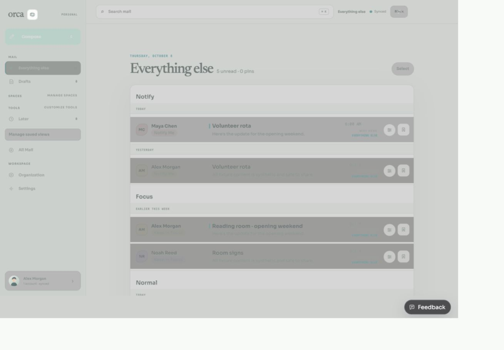
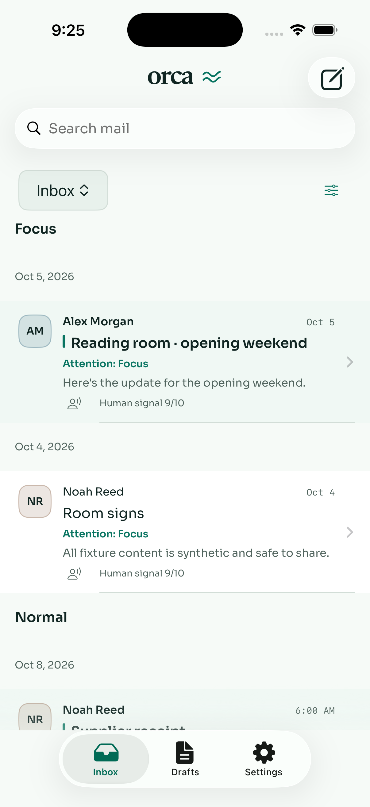
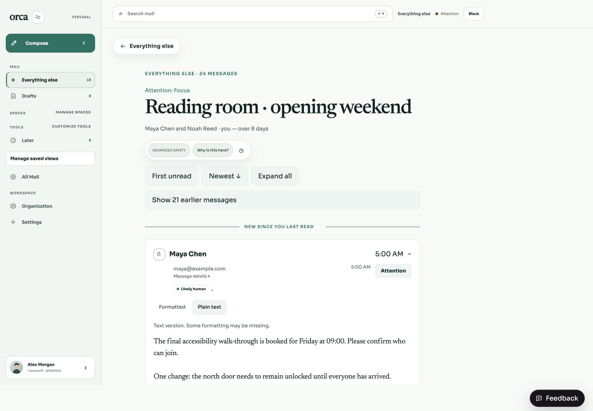
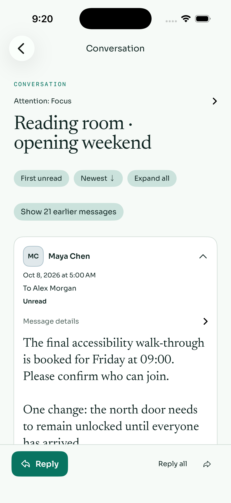
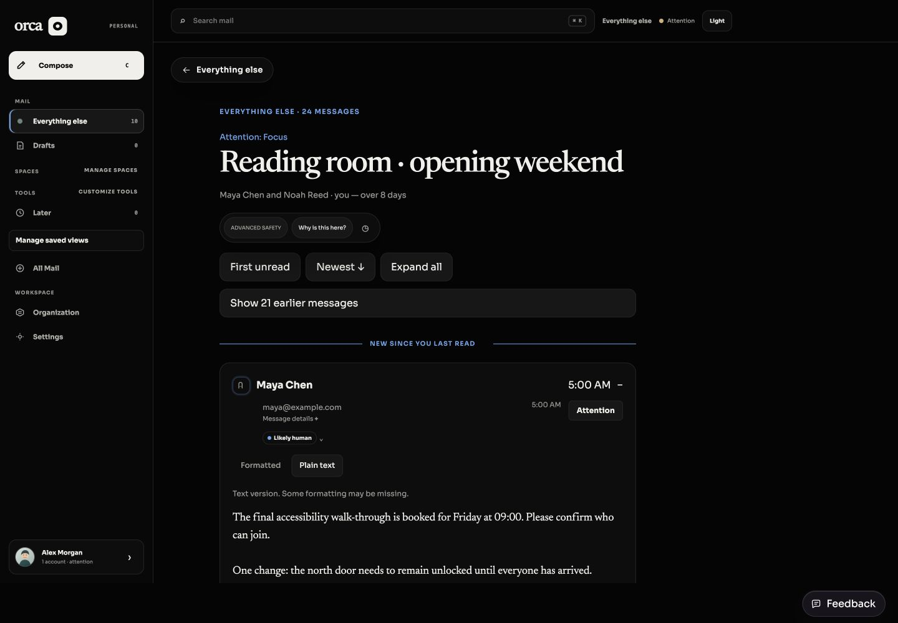
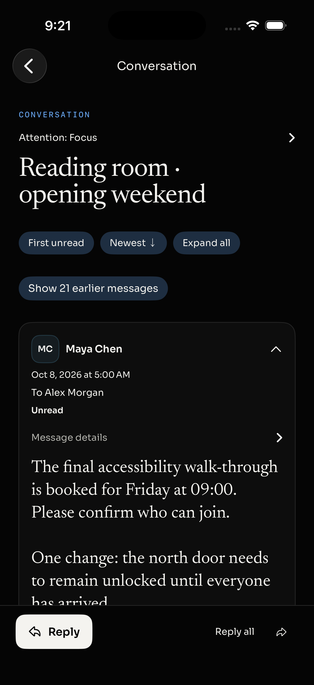
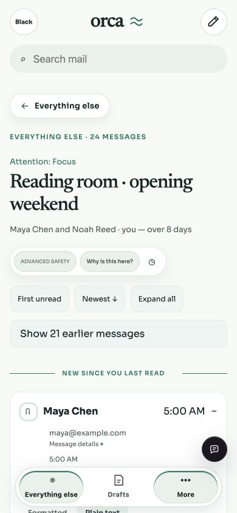
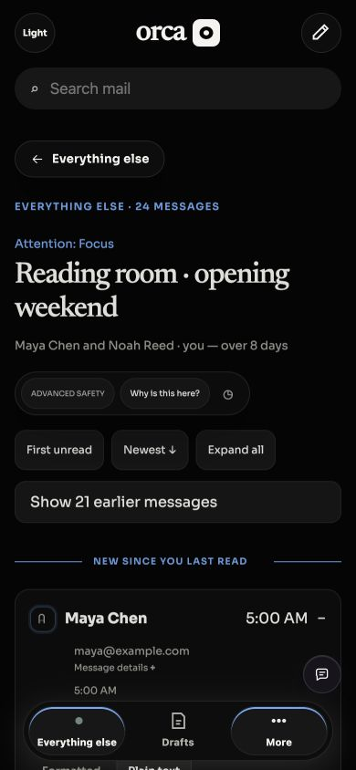

# Approved attention and conversation reader

Production implementation of the direction reviewed in draft #236. Changes cover web (desktop/mobile) and native iOS. Existing Notify → Focus → Normal → Quiet → Hidden ordering is unchanged; visible attention headings explain it, with dates inside each group. Native headings use the local calendar. Destination and attention remain separate; existing web provenance controls are retained and native discloses when winning-rule provenance is unavailable.

Readers open the first unread message, or the latest when all are read. Earlier messages remain available behind a disclosure; cards retain sender/time/recipients/previews, with expand/collapse and unread/latest navigation. Web preserves the unread-at-open target across read refreshes and accepts newly arriving unread messages. Native preserves the initial reading boundary across refreshes.

Quote folding is conservative and lossless. Inline answers and forwarded prose remain visible. When text has an unambiguous trailing quoted block, the initial text view folds it; the complete formatted alternative stays available through the existing secure renderer. HTML-only messages retain their formatted rendering. Complete original text preserves whitespace and CRLF. Attachments, reply source data, sanitization, native link handling, and existing production read-state behavior are unchanged.

## Evidence

All screenshots use a local synthetic 24-message fixture with 3 unread messages, nested quotes, HTML alternatives, and attachment metadata. No live account was connected. Fixture read requests were acknowledged without changing fixture data. No merge, release, signing, or provider action occurred.

| Web attention groups | Native attention groups |
| --- | --- |
|  |  |

| Web reader | Native reader |
| --- | --- |
|  |  |
|  |  |

| Mobile light | Mobile dark |
| --- | --- |
|  |  |

## Checks

- New quote regressions were first observed failing on the previous implementation (inline answers folded; whitespace/CRLF rewritten), then passed.
- Focused final web suite: 75 tests, 387 assertions. Includes rendered 24-message first-unread/all-read, read-refresh stability, newly arriving unread mail, expand/collapse, unchanged source read flags, and no mutation requests.
- Broader web suite: 592 tests, 4,533 assertions passed before the final new-unread fallback adjustment; focused tests were rerun after that adjustment. Web TypeScript check passed.
- Unsigned simulator build succeeded. Three XCTest regressions passed: quote recovery, bounded preview decoding, and local-calendar day grouping across a New York midnight boundary.
- Browser verified three initially visible cards/one expanded, no horizontal overflow at desktop, Newest focus on message 24, and First unread focus on message 22. Desktop and 390-pixel mobile screenshots captured in both themes.
- Native fixture UI verified first-unread opening, collapsed later cards, quote/original/format controls, newest card becoming expanded and visible, and local-date attention grouping. Native light/dark screenshots captured on the dedicated simulator.
- Independent review found and verified fixes for read-refresh concealment, newly arriving unread navigation, and UTC/local date disagreement. No remaining blockers reported.

VoiceOver focus is explicitly set on native jumps but a complete VoiceOver session and full Dynamic Type matrix were not exercised. These remain review checks; screenshots do not constitute release approval. The native simulator is shut down after evidence capture.

## Reproduce

Web regressions: `bun test apps/web/src/reader-cards.integration.test.tsx apps/web/src/reader-quote-regression.test.ts apps/web/src/mail-preview.test.ts apps/web/src/reader-body.test.tsx apps/web/src/App.test.tsx`.

Native regressions are in `OrcaTests`: `testReaderQuotesPreserveExactTextAndInlineAnswers`, `testPreviewDecodingIsBoundedTextOnly`, and `testAttentionDateGroupsUseTheLocalCalendar`.

The fixture source is the synthetic design fixture from #236. The local verification server adapts count serialization to each client's existing response shape and rejects non-read mutations. Baseline reproduction details remain in that design PR; no private source screenshot was copied into this change.
