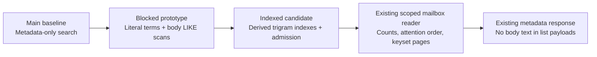
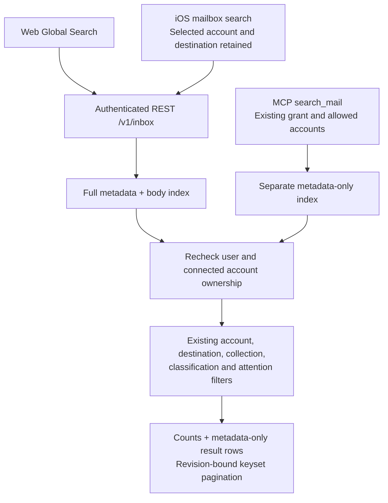
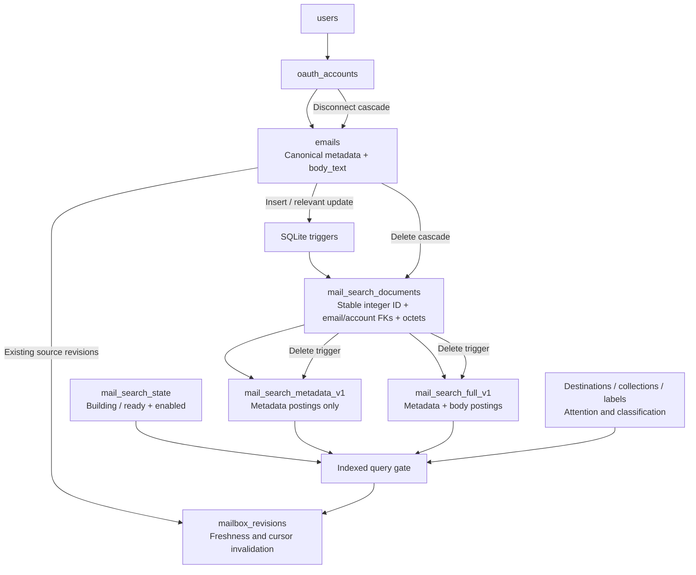
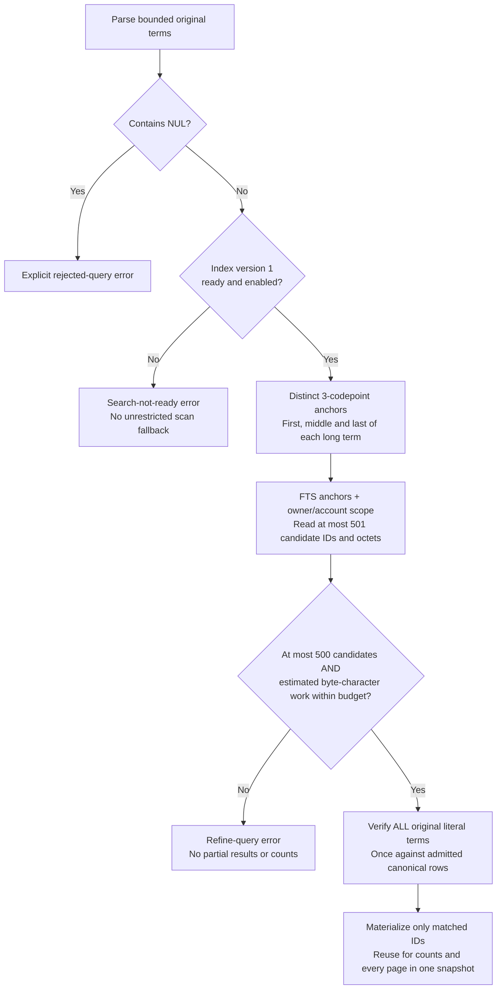
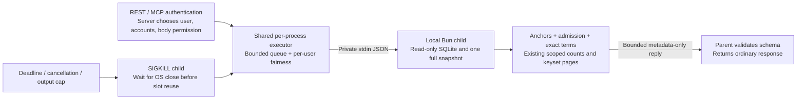
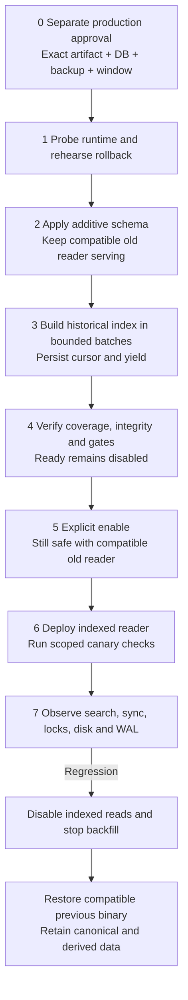

# Orca indexed mail search migration and blast radius

**Review draft, 5 October 2026. Implementation and disposable-data testing are authorized; production migration, backfill, activation, deployment and merge are not.**

The direct body-scan prototype cannot ship: accepted queries can synchronously block the API for seconds. This plan replaces it with derived SQLite FTS5 trigram indexes, a resumable historical build, database-maintained consistency and an explicit activation gate. Canonical mail rows and account permissions remain authoritative.

Baseline: `main` commit `24c0de7`, tree `846b46c`. Source paths below refer to the review candidate. This revision and the accompanying eight-page visual PDF reflect the positionless index, bounded literal verification and one-shot read-only process design. Evidence status is recorded below; exact-head hosted CI and production approval remain separate gates.

## 1. What changes



The stored search contract is literal: all terms match one message, in any order across sender, subject, preview and stored plain-text body. Double quotes group a contiguous phrase. Partial words remain substrings. There are no search operators, stemming, fuzzy matching or relevance ranking. Broad queries can be explicitly rejected by the admission gate described below. The parser caps input at 200 characters and 16 distinct terms/phrases and deduplicates repeated terms. Invalid input is rejected, not silently truncated.

### Boundaries that stay in place



- Only the server chooses body authority. Client query parameters cannot opt MCP into body matching
- MCP search results, counts and admission must not depend on body content or body size
- Candidate selection checks `oauth_accounts.user_id`; the mailbox reader separately retains its existing authorized-account restrictions
- Result lists still return sender, subject, preview, account, classification and routing metadata, not body text or body-centered snippets
- Every nonempty search cursor must include the mode/index-semantics scope as well as query, filters, accounts and mailbox revision; old text-search cursors restart
- Unfiltered inbox, thread reader, provider OAuth grants and provider fetch scope are not enlarged

## 2. Database dependencies and physical blast radius

Candidate objects in `apps/api/drizzle/0051_indexed_mail_search.sql`:

| Object | Role | Change impact |
| --- | --- | --- |
| `mail_search_state` | Singleton version, phase, enabled flag, resume cursor and verification time | Starts at version 1, `building`, disabled; readiness does not imply activation |
| `mail_search_documents` | Stable integer `document_id` mapped to unique email UUID and account; byte budgets | Source email/account foreign keys cascade; stable IDs survive `VACUUM` |
| `mail_search_documents_account_idx` | Account/document lookup | Additional B-tree writes and disk |
| `mail_search_metadata_v1` | Contentless-delete, positionless trigram postings for metadata only | MCP-safe matching independent of body postings |
| `mail_search_full_v1` | Contentless-delete, positionless trigram postings for metadata plus body | First-party body matching without copying another full body value |
| `mail_search_documents_ai`, `_au`, `_ad` | Maintain both FTS tables when mapping changes | Runs within the same source write transaction |
| `mail_search_emails_ai`, `_au` | Maintain mapping/byte counts for email inserts and relevant changes | Covers old/new application writers and direct SQL writes using compatible SQLite |
| FTS5 shadow tables | Internal postings, sizes and configuration | Additional DB, WAL, backup and maintenance footprint; not an external service |



The schema is additive and does not rewrite or scan historical email bodies at migration time. However, **the migration immediately adds work to every subsequent email insert, relevant update and delete**, even while search remains disabled: SQLite triggers tokenize new or changed text and update postings. It is not a zero-impact migration.

### Consistency contract

| Event | Required behavior |
| --- | --- |
| Historical row before migration | Backfill creates one mapping and both postings; reads remain gated until coverage is verified |
| New message | Trigger inserts mapping and both postings in the same transaction |
| Sender/subject/preview/body change | Trigger refreshes both postings; old terms stop matching; existing mailbox revision advances |
| Read flag or unrelated non-text change | Existing mailbox behavior/revision preserved; avoid unnecessary re-tokenization |
| Email/account key change | Mapping foreign-key updates and triggers preserve ownership and searchable text |
| Email deletion | Cascade removes mapping; delete trigger removes both live FTS entries |
| Account disconnect | Existing account deletion cascades through canonical mail, mappings and live search entries |
| Transaction rollback | Canonical write and derived updates roll back together; no half-updated index |
| Old application writer after migration | Database triggers still run; the old runtime must support the new SQLite features |

Removing live index entries is **not a secure erasure guarantee** for WAL pages, old database pages or retained backups. Existing retention and backup protections must cover these new derived postings. Contentless indexes omit a second stored text copy but still encode sensitive mail information.

## 3. Query behavior and admission

Implementation source: `apps/api/src/mailbox/search-index.ts`. **All text queries go through admission**, not only short queries. Direct long-phrase positional FTS was also rejected after a repetitive 200-character query on 100 synthetic 8 KiB bodies took about 885 ms synchronously. Both candidate indexes now use `detail=none`; FTS receives only literal single-trigram anchors.



### Exact contract

- For each term of at least three Unicode codepoints, take the first, middle and last three-codepoint slices; deduplicate anchors across the query. Each anchor is safely quoted and anchors are joined by `AND`
- Anchors only narrow candidates. They can match different locations or fields and admit false positives. Every original term/phrase is then verified with escaped literal `LIKE` against canonical text, preserving complete semantics for every admitted query
- No global three-character minimum is introduced. Short-only queries use the same admission gate without FTS anchors. A specific word/phrase of at least three characters can help narrow candidates, but acceptance is not guaranteed
- The candidate limit is 500 authorized messages. Read at most 501 candidate IDs to detect over-limit requests; never serve the first 500 as complete
- Estimated work is **sum of candidate source octets × sum of original term `.length` values (UTF-16 code units)**, capped at **33,554,432** (`32 * 1024 * 1024`) estimated byte-character units. This is a conservative comparison-work estimate, not a memory allocation or wall-clock deadline
- Body octets are included only on the first-party full-text path. MCP admission, FTS lookup, results and counts do not depend on bodies
- All literal verification runs once before mailbox counts/pages. Only the matched email IDs are reused, so account/attention page queries do not multiply body verification work
- Candidate narrowing uses anchors and authorized accounts. Mailbox/destination, collection, sender and date filters occur later; narrowing only those filters cannot rescue a query rejected by candidate admission
- Broad/common searches or weak-anchor false positives can require refinement even if the final exact-match set would be small. This is deliberate: no incomplete success responses and no unrestricted fallback
- NUL-containing queries are explicitly rejected. Source NUL behavior remains compatible with the existing literal scan and has dedicated regression tests
- Source text uses SQLite ASCII `lower` and case-sensitive trigram tokens; canonical verification retains the existing ASCII case behavior rather than introducing Unicode case/accent folding
- Metadata and body remain separate fields for canonical matching. A phrase cannot bridge the metadata/body boundary. The existing concatenated metadata representation remains unchanged
- Query preparation, admission, verification, counts and pages share one read transaction/snapshot. FTS stores no positions (`detail=none`), avoiding the rejected expensive long positional-phrase evaluation
- Admission bounds body comparison work and returned candidate IDs. Common postings and tenant-scoped candidate discovery still have corpus-dependent cost; mixed-load latency and event-loop delay remain release gates

### User-visible failure behavior

`search_query_too_broad` is REST HTTP 400 and means refine the query or selected account; `search_index_not_ready` is HTTP 503 and means indexing/activation is unavailable. MCP retains these structured error codes through its read boundary. REST `search_busy` is HTTP 503 with `Retry-After: 1`; `search_aborted` maps to HTTP 408; internal invalid requests to 400; unavailable database/failed process to 503. Both surfaces must show these errors clearly. iOS must not replace these server errors with cached local-search results and make them appear complete. Input validation and readiness are distinct from a successful zero-result response.

### Local process isolation

`search-executor.ts` and `search-worker.ts` implement a **local read-only Bun child process** for the complete text-search snapshot. Both nonempty REST and MCP text queries now call this singleton executor. The focused lifecycle/read-only/queue/WAL/deadline tests pass; final aggregate checks and deployment packaging remain gates. This prevents pathological SQLite work from running directly on Hono's main JavaScript event loop. No external service is added. Ordinary unfiltered inbox reads keep their existing path.



| Control | Inspected implementation |
| --- | --- |
| Active readers | 1 active child per API process; 1 active per user |
| Queue | 8 pending per API process; 1 pending per user; unrelated users can use a free slot |
| Queue deadline | 1,000 ms; over-capacity or expired queue returns `search_busy` |
| Runtime deadline | 2,000 ms after process launch; runtime/output-budget failure returns `search_query_too_broad` |
| Cancellation | Request abort gives `search_aborted`; active child is killed |
| Graceful shutdown | `shutdownMailboxSearch` rejects queued jobs, closes admission, kills active children and awaits close; wired into the API SIGTERM/SIGINT handler alongside server close before process exit |
| Capacity reuse | Send `SIGKILL`; wait for child `close`/OS exit before releasing the active slot, including errors |
| Input/output | Strict versioned JSON; stdin 64 KiB; stdout 2 MiB; stderr capture capped at 8 KiB then discarded, never exposed |
| Child execution | `process.execPath --no-env-file --smol` plus a trusted absolute entrypoint resolved from `import.meta.url`; no shell or query in argv; only TZ/LANG environment |
| SQLite | `readonly: true`, `create: false`, `strict: true`; `query_only=ON`; busy timeout 100 ms; 8 MiB SQLite cache target |
| Data boundary | Parent supplies user/account authorization and body permission; child rechecks source ownership; no bodies or raw SQL errors in output |
| Snapshot | Full reader plus provider/scope metadata for parent capability projection share one outer read transaction |
| Unsupported database | In-memory/unavailable file-backed targets fail with `search_database_unavailable`; no synchronous fallback |

These limits are **per API process**, not a cross-replica global rate limit. The conservative single-child default trades throughput for a smaller memory footprint: bursts can return busy errors. Raising concurrency requires code review and measured host headroom; there is no production environment knob to silently bypass the cap. Queue and runtime limits are separate: an accepted queued request can wait up to about one second before its two-second process budget, plus process teardown/scheduling overhead. They are not a promise of an exact two-second HTTP response.

### Why a local subprocess

| Option | Decision | Reason |
| --- | --- | --- |
| Bounded SQL in Hono | Insufficient by itself | `bun:sqlite` is synchronous; typical admitted costs improve, but corpus/hardware variation can still block the main event loop |
| Bun Worker thread | Not chosen for the hard execution boundary | Official docs describe termination as experimental and say a close event can precede full exit |
| Persistent read-only process | Considered conceptually, deferred | Reuse could amortize startup; adds request protocol/reset, health checks/recycling and lifecycle recovery after kill/deadline. No persistent-worker architecture is being built in this slice |
| One-shot local Bun subprocess | Chosen | Smallest verified raw-TypeScript implementation; OS-level kill plus confirmed child exit before capacity reuse, with explicit startup/RSS costs |

The Worker distinction comes from [Bun's official Workers documentation](https://bun.com/docs/runtime/workers). It is a design reason, not a claim that all Worker usage is unsafe.

Production needs a host that supports local child-process spawning, the pinned Bun executable and relative TypeScript entrypoint/imports, and read-only access to the same durable SQLite/WAL file. Process isolation removes direct main-loop SQL execution; it does not eliminate shared-host CPU, RSS, disk or writer contention. Test process startup/RSS, single-child load and queued bursts, queue pressure, timeout, cancellation, output overflow and failed-child cleanup against the real deployment packaging before rollout. All tests must prove capacity is not reused until the old child is gone. An uncatchable parent SIGKILL can bypass graceful handlers; verify that deployment terminates the whole container/process group so a pathological child cannot be orphaned.

## 4. Deployment sequence and availability

**Production sequence below is a proposed operator procedure, not authorization to execute it.** All rehearsals use disposable synthetic databases. All files/runtime versions used for migration and rollback must be pinned together.



### Important availability distinction

`prepareMailSearch` currently requires ready/enabled state for **both REST full-text and MCP metadata-only text searches**. Deploying the new reader before readiness can therefore make all nonempty server text search return `search_index_not_ready`. Unfiltered mail is a separate path.

To preserve the current search service during a future approved rollout, run migration/backfill with a **compatible old reader** still serving, verify and enable the index, then deploy the indexed reader. This requires a separately controlled migration step rather than blindly relying on the new release's startup hook. If infrastructure cannot separate these steps, explicitly plan and approve a search maintenance window. Railway uses RAILPACK and `bun --cwd apps/api start`; the API start script runs raw TypeScript `bun src/db/migrate.ts && bun src/index.ts`. All pending migrations therefore run before the new API starts. Package the relative child entrypoint and its imports alongside the API, and test the same command/runtime as deployment.

### Phase gates

1. **Preflight:** verify the exact SQLite runtime used by API, admin tools and rollback binary. Test FTS5 trigram, `contentless_delete` and `octet_length`; require SQLite >=3.43 and the actual feature probe. Bun 1.3.14 / SQLite 3.53 is the local tested target
2. **Backup and capacity:** produce a consistent SQLite backup/snapshot and rehearse restore on a separate copy. Do not `cp` only the live main DB while WAL writes continue. Size free capacity against measured peak DB + WAL + temporary/build growth plus a retained backup and agreed reserve
3. **Schema:** apply migration 0051 on the verified target only after approval. Confirm disabled/building state; old reader continues serving. Stop if migration or subsequent test writes fail
4. **Backfill:** separate admin process, short immediate transactions, persisted email-ID cursor. Default batch limits are 100 rows/4 MiB; support limited batches with pauses and resume. Stop rather than skip an oversized message or silently mark ready
5. **Verify:** require source/mapping coverage, no orphan rows, FTS integrity and insertion/update/deletion/disconnect tests. Verify is potentially expensive; do not run in the request path
6. **Enable and cutover:** only after all correctness/security/performance gates and explicit authorization. Check real readiness, then enable and deploy compatible reader. Run canary searches in each permitted authority mode without logging private bodies
7. **Observe:** compare accepted-query latency/error rate, event-loop delay, sync/write latency, lock timeouts, disk/WAL growth and cursor errors. Stop or roll back when agreed gates fail; record artifacts and symptoms without mail contents

## 5. Exact command runbook

The following existing commands are verified in repository scripts. Use an absolute, explicitly selected **disposable** path in review rehearsals:

```sh
DATABASE_PATH=/tmp/orca-search-review.sqlite bun apps/api/src/db/migrate.ts
bun apps/api/src/db/verify.ts  # Separate disposable migration regression fixtures
bun run typecheck
bun run test
bun run build
```

`DATABASE_PATH` resolves relative values from `apps/api`, independent of the shell's current directory. The generic `db/verify.ts` script uses its own temporary fixtures; it does not inspect the selected target database. Use the search admin `verify` command below for the actual selected index. The following admin commands are verified against `mail-search-admin.ts` and a disposable 12-message pre-migration fixture. Run from the repository root. The tool requires an existing explicit `--database`, refuses nonexistent paths and never applies migrations. `DB` below is a rehearsal path, not a production destination.

```sh
DB=/tmp/orca-search-review.sqlite
ADMIN=apps/api/src/db/mail-search-admin.ts

# Inspect the additive disabled/building state
bun "$ADMIN" --database "$DB" status

# Build one bounded batch; repeat the same command to resume
bun "$ADMIN" --database "$DB" backfill \
  --batch-rows 100 --batch-bytes 4194304 --max-batches 1 --pause-ms 100

# For an approved longer run, still yield between bounded transactions
bun "$ADMIN" --database "$DB" backfill \
  --batch-rows 100 --batch-bytes 4194304 --max-batches 100 --pause-ms 100

# Full verification: phase becomes ready, but enabled remains false
bun "$ADMIN" --database "$DB" verify
bun "$ADMIN" --database "$DB" status

# Rehearsal only here; production activation requires separate approval
bun "$ADMIN" --database "$DB" enable
bun "$ADMIN" --database "$DB" status

# Disable indexed reads without deleting any canonical or derived data
bun "$ADMIN" --database "$DB" disable
bun "$ADMIN" --database "$DB" status
```

Defaults are 100 rows / 4 MiB source bytes, one batch per command and 100 ms between batches. Accepted limits are 1..1,000 rows, 1 byte..64 MiB bytes, 1..10,000 batches and 0..60,000 ms pause. A message larger than the selected byte budget stops that batch without advancing the cursor; increase the explicit budget only after capacity review. A message larger than 64 MiB is a build blocker requiring a separately reviewed approach. The source-byte bound is not a guaranteed transaction-time or index-output bound.

A `complete: true` batch means historical traversal reached the end; it **does not** set `phase=ready` or enable reads. `verify` checks canonical/mapping account and byte coverage, orphans, both FTS row-ID sets and FTS internal integrity. `enable` repeats verification and activation atomically. These full verification operations use an immediate write transaction and are not constrained by the batch limits; measure their write-blocking interval and schedule accordingly. Internal integrity/row/byte checks cannot independently prove arbitrary forged same-length postings match source content. Trigger tests, deterministic reference parity and canary queries remain necessary.

Rehearsal result: post-migration 0/12 indexed and disabled; incomplete enable exited 1; first batch committed 3 rows; a new process resumed to 12/12; verification produced ready/disabled; enable produced ready/enabled; disable restored ready/disabled. All canonical rows survived. A follow-up rollback rehearsal confirmed the old baseline reader still returned 12 metadata matches, while the disabled new reader rejected text search and still returned 12 unfiltered rows. This is operator-control evidence on the tested runtime, not a full deployment or production-scale performance test.

### Rollback recipe

The tested old-reader rollback is for read-path/cutover faults. It is not a universal recovery from derived-index write corruption.

1. If the indexed query path is unsafe, disable it with the reviewed admin command and verify the persisted disabled state. This intentionally causes a temporary search-not-ready response in new readers; it does not silently reinstate the blocked body scan
2. Stop the backfill process if one is still running. Committed batches and resume state are retained; an interrupted transaction must roll back
3. Restore the **tested compatible** previous application binary and runtime, returning to metadata-only search. Do not downgrade SQLite below the features required by the still-installed triggers
4. Retain additive schema and data during incident recovery. Disabling reads does not remove index write overhead. If tokenization/write cost or derived-index corruption itself is the incident, old-binary rollback may not restore writes. A separately approved derived-index repair or retirement procedure is required; disable is insufficient
5. Verify unfiltered inbox, metadata search, sync writes, deletes and account authorization using safe canaries. Record which release and readiness state are active
6. Do not delete canonical emails, hand-edit the migration journal, or restore an older DB over current mail merely to undo the index. A casual canonical-mail restore/drop can also lose newer organization changes, not only messages. Restore a backup only under a separately approved data-recovery decision with an understood data-loss window

## 6. Resource and operational impact

| Resource | Impact | Required measurement / guard |
| --- | --- | --- |
| Disk | Two FTS indexes, mapping/state, shadow tables; metadata represented twice | Base/after DB bytes, index bytes, peak WAL, temporary growth, backup size; representative-text entropy |
| CPU | Trigram tokenization on backfill and relevant writes; query postings/intersections | Build CPU/time, query p50/p95/max, event-loop delay, write latency |
| I/O | Read all existing searchable text once for build; write postings and WAL | Build throughput, storage saturation, checkpoint pressure; pause batches |
| Writer lock | SQLite has one writer; each backfill transaction competes with sync and deletes | Transaction duration, busy errors, sync lag; small batches and yield |
| API availability | Isolated text readers move synchronous SQL out of Hono; bounded queues and process limits can return busy/timeout errors | Mixed request traffic, cancellation/timeout, exit before slot reuse, child startup and parent event-loop delay |
| Child processes | New Bun subprocess startup/RSS, executable and entrypoint packaging; read-only shared DB access | Exact deployment command smoke test, RSS under the single active child, process cleanup, queue capacity and rollback release files |
| Startup | New schema migration runs before API start | Measure migration latency; keep historical build separate from startup |
| Disconnect/deletes | Index deletion cost added to existing cascades | Large-account disconnect/delete test with atomicity and bounded operational window |
| Backup/privacy | Postings are derived private mail data | Existing access controls, backups and retention apply; no external search service |
| Rollback | Old code still executes new triggers | Test rollback runtime and writes; disabling reads retains write overhead |

WAL permits readers alongside a writer; it does not permit multiple simultaneous writers. The current client uses WAL, `foreign_keys=ON`, and a 5,000 ms busy timeout. These are existing settings, not proof the backfill is non-blocking. Network/shared filesystem deployment also needs a verified SQLite/WAL-compatible topology.

### Current scan evidence

These are local synthetic warm-cache observations, not a production SLA or an equivalent-work speedup comparison with the old metadata-only reader:

- 20,000 messages, approximately 8 KiB bodies and 16 body-end terms: prototype p95 approximately 3.63 seconds
- 20,000 messages, approximately 8 KiB bodies with 1% at 300 KiB, ordinary ASCII body-end words, 2 warmups and 5 samples: p95 body-only 489 ms; 4 terms 798 ms; 8 terms 1,590 ms; 16 terms 2,850 ms
- A separate CJK single-codepoint stress variant with large-body outliers reached approximately 5.44 seconds for 16 terms

### Final positionless index build measurement

Source: `docs/verification/mail-search/index-build-20k.json`. Bun 1.3.14 / SQLite 3.53; 20,000 messages, normal bodies 8 KiB and 1% at 300 KiB; 225.1 MB indexed source. This uses a deterministic 512-word synthetic vocabulary and **minimal canonical schema** to isolate index cost. Real application triggers, text entropy, disk and contention add cost. Decimal MB values below are rounded; raw bytes are in the evidence file.

| Measurement | Observed result |
| --- | --- |
| Additive migration | 1.86 ms, no historical body build |
| Historical backfill | 33.90 s across 200 batches of 100 rows, with no between-batch pauses |
| Batch time | p50 149.65 ms; p95 290.06 ms; maximum 494.29 ms |
| Full verify and enable writer interval | 937.29 ms |
| Canonical DB to built DB | 234.4 MB to 281.0 MB |
| Physical derived growth | +46.6 MB, about 20% of this synthetic base DB |
| Peak observed WAL | 11.66 MB |
| 100 read-flag writes | 2.93 ms |
| 100 body updates | 145.94 ms |
| 100 deletions | 20.84 ms |

These measurements do not establish production capacity or an SLA. Default admin pauses add about 19.9 seconds across 200 batches to the 33.9-second no-pause workload before unrelated overhead. Batch byte/row bounds did not make writes instantaneous: a measured batch held work for up to about half a second. Verification/enable must be scheduled and measured as a separate full-corpus writer operation. The posting-block byte counts in the raw file exclude tree overhead and were taken after maintenance; use physical DB/WAL growth for capacity planning.

The separate-process interruption/resume and rollback-readiness rehearsal was repeated successfully on a fresh final positionless-schema fixture. Reader microbenchmarks and child-process overhead are recorded below; real deployment-scale mixed traffic and cold-disk measurements remain gates. All-query candidate/estimated-work admission does not replace these measurements.

### Final reader microbenchmark and process overhead

`docs/verification/mail-search/index-query-20k.json` records the final bounded positionless reader with 20,000 messages, approximately 8.58 KiB typical bodies, 1% at 300 KiB, two warmups and five warm-cache samples. Accepted searches matching 200 messages had p95 21.03 ms (sender/subject), 30.20 ms (body-only), and 21.78 ms (sender+body). No-match p95 was 4.66 ms. Four/eight/sixteen all-mail body-end terms were **rejected** with `search_query_too_broad` in p95 1.74/2.00/3.86 ms; these are refusal latencies, not fast completed searches. Unfiltered reader p95 was 237.64 ms and remains a different path. A fresh SQLite connection still benefits from the OS page cache; none of this is a cold-disk test.

Source: `docs/verification/mail-search/process-cost.jsonl`. Corrected process comparison: ten alternating raw-TypeScript and temporary-bundle runs on a synthetic 100-message fixture with approximately 6 KiB bodies. Raw TypeScript median round-trip was 339 ms, maximum 370 ms, mean reader 13 ms, and child Linux `/proc/self/status` VmHWM approximately 104 MiB at snapshot completion. A temporary 0.83 MB Bun bundle (122 modules) measured median 303 ms, maximum 536 ms, mean reader 11 ms and VmHWM about 90 MiB. This limited comparison does not establish a stable production percentile. Earlier runs under different host load varied materially. The candidate retains the simpler raw TypeScript deployment; the temporary bundle is not shipped.

Child memory uses Linux VmHWM; inherited `getrusage.maxRSS` values were found unreliable and are excluded. Non-Linux child memory is unknown. The shipped default is deliberately **one active child per API process** pending a verified Railway memory budget. Allow for the observed roughly 104 MiB child VmHWM in addition to API RSS and reserve; this is an observation at snapshot completion, not a memory limit or a guaranteed whole-lifespan ceiling. The 8 MiB SQLite cache target is only one part of total process RSS. Measure real deployment concurrency and enforce appropriate host/container memory headroom.

Do not present the reader's 30.2 ms microbenchmark as end-to-end HTTP latency. Startup, module loading, IPC, queue wait and response validation add material cost. The one-second queue and two-second execution budgets protect responsiveness but can return explicit busy/refine-query errors under load.

## 7. Verification matrix and release gates

| Gate | Required evidence | Current status |
| --- | --- | --- |
| Semantics | Body-only beyond preview; all terms one message; cross-field/order; quotes; literals; partial words; Unicode/NUL edges; HTML-only/null | Indexed reader/search 34/34 passed; storage deterministic parity also passed |
| Migration | Fresh schema; pre-existing mail; no automatic build; disabled default; unsupported SQLite; journal | Actual migration/client 3/3 and disposable pre-migration operator rehearsal passed |
| Consistency | Insert/update/delete; unchanged-text update; account disconnect; foreign keys; transaction rollback; old writer; VACUUM | 17 focused storage tests and 2 CLI tests passed on the all-query admission revision, including deterministic 80-message LIKE parity and long repetitive-query rejection |
| Backfill | Row and byte batching; oversized document stop; resume; max batches; concurrent writes; idempotent rerun; readiness only on complete valid coverage | Focused tests, 12-message separate-process rehearsal and 20k synthetic build passed; production lock/capacity gate remains |
| Readiness | Missing/building/disabled/wrong-version errors; verification failure cannot enable | Incomplete enable rejected; ready remains disabled until explicit enable; disable passed |
| Security | Foreign account and counts; MCP no body dependency; REST/MCP cursor replay; no bodies in list payload; unauthenticated denial | Real REST/MCP session-search through subprocess passed; body matches, MCP exclusion, admission/no partial counts and disabled 503/unfiltered behavior covered |
| Pagination | Cross-account tied dates; all scopes; changed query/mode/revision rejection; no skips/duplicates | Included in 34/34 reader/search tests; existing two-owned-account REST pagination passed through subprocess |
| Isolation | Busy/cancel/deadline, OS kill/reap, slot fairness/reuse, output bounds, read-only WAL snapshot, graceful shutdown | Lifecycle tests passed, including real nonreturning native SQLite work with responsive parent timers/HTTP; final single-child-default rerun pending |
| Performance | 1k/5k/20k mail, 8 KiB and outliers, short/broad/16 terms, warm+cold, mixed traffic, storage/write impact | Final 20k reader/storage/build evidence recorded; preliminary process overhead measured; true cold-disk and deployment-scale gates remain |
| Web | Built app on real disposable API/SQLite, desktop/mobile, light/dark, body matches, phrase order, literal input, reader/Back, excessive-term error and broad-query error | Hosted browser not yet run. A full-web reader-refresh assertion also reproduces on the unchanged baseline; final head evidence must identify it explicitly |
| Native | iOS fixture current account/mailbox scope, body-only confirmation beyond preview, light/dark and UI evidence | Hosted native run pending |
| Release | Typecheck, tests, build, hosted checks, reviewed operational commands, capacity and rollback rehearsal | Final workspace typecheck passed; lint/build/full-test are running serially at this review snapshot. Exact-head hosted CI and production approval remain required |

Expected focused checks in the candidate:

```sh
bun test packages/shared/src/mail-search.test.ts apps/api/src/mailbox/search.test.ts
bun test apps/api/src/mailbox/search-index.test.ts
bun test apps/api/src/mailbox/search-executor.test.ts
bun test apps/api/src/agents/mcp.test.ts
bun test apps/web/src/global-search.test.tsx
bun apps/api/benchmarks/mail-search.ts
python3 scripts/ci/test-export-evidence.py
```

Existing unfiltered mailbox p95 targets in `mailbox/read.ts` are 500 ms at 1,000 messages and 750 ms at 5,000; these must not regress. A final indexed-search and event-loop latency budget must be chosen from measured behavior and reviewed explicitly rather than inferred from an index's presence. Any unbounded fallback, scope leak, incomplete-result success response, failed integrity check or untested rollback compatibility blocks rollout.

## 8. Known limits and deliberate non-goals

- Only already-synced/stored mail is searched. This does not query a provider's full history or fetch old mail on demand
- HTML-only bodies are not reconstructed or searched; metadata/preview can still match. Attachments are not searched
- Web inline **Search the stream** remains a loaded-row metadata filter and can lose older matches through latest-message conversation grouping
- iOS retains selected account and mailbox/destination scope
- Results retain attention/date ordering; snippets are not match-centered excerpts
- Saved Views still reject general text as an unsupported clause; subject-only matching requires an explicit user choice
- No new provider permissions, external indexing service, fuzzy search, stemming or relevance ranking
- On a disabled/not-ready new reader, text search is unavailable by design; unfiltered mail remains the normal path

## 9. Sources

Repository authority:

- `AGENTS.md`, `README.md`, root and API `package.json`: runtime, startup and database commands
- `apps/api/src/db/{client,config,migrate,schema}.ts`: WAL/foreign keys/busy timeout, path resolution, migrations and canonical schema
- `apps/api/drizzle/0035_bounded_mailbox_reads.sql`, `0036_mailbox_revision_root.sql`: page index and revision triggers
- `apps/api/drizzle/0051_indexed_mail_search.sql`: new state, document map, indexes and triggers
- `apps/api/src/mailbox/search-index.ts`: readiness, anchors, all-query admission and once-only literal verification
- `apps/api/src/mailbox/search-executor.ts`, `search-worker.ts`: local process queue, deadline/cancellation, private protocol and read-only snapshot
- `apps/api/src/db/mail-search-admin.ts` and `mail-search-index.ts`: operator commands, verification and resumable build
- `apps/api/src/mailbox/read.ts`, `apps/api/src/index.ts`: authenticated reader, counts/pages and REST/MCP authority
- `packages/shared/src/mail-search.ts`: parsing and input bounds
- `apps/web/src/global-search.tsx`, `apps/ios/Orca/Mail/InboxView.swift`: user search surfaces
- `docs/verification/mail-search/index-build-20k.json`: final positionless synthetic build/storage/write-cost measurement
- `docs/verification/mail-search/index-query-20k.json`: bounded-reader warm-cache query/rejection microbenchmarks
- `docs/verification/mail-search/process-cost.jsonl`: corrected raw-TypeScript/bundle child latency and Linux VmHWM comparison
- `docs/verification/stored-mail-search.md`, `apps/api/benchmarks/mail-search.ts` and focused test files: contract and reproducible synthetic evidence

Platform references:

- [SQLite FTS5 trigram and contentless-delete tables](https://sqlite.org/fts5.html): index features, phrase behavior and contentless-delete compatibility
- [SQLite WAL behavior](https://sqlite.org/wal.html): reader/writer concurrency, checkpoint/storage considerations and filesystem limitations
- [SQLite scalar functions](https://sqlite.org/lang_corefunc.html): ASCII `lower` and octet sizing
- [Bun Workers](https://bun.com/docs/runtime/workers): termination and close-event semantics informing the subprocess choice

No private mailbox content is included in this plan or its examples.
