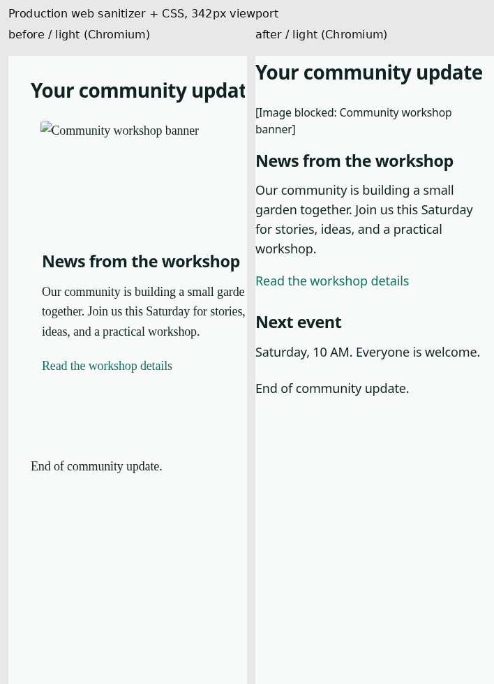
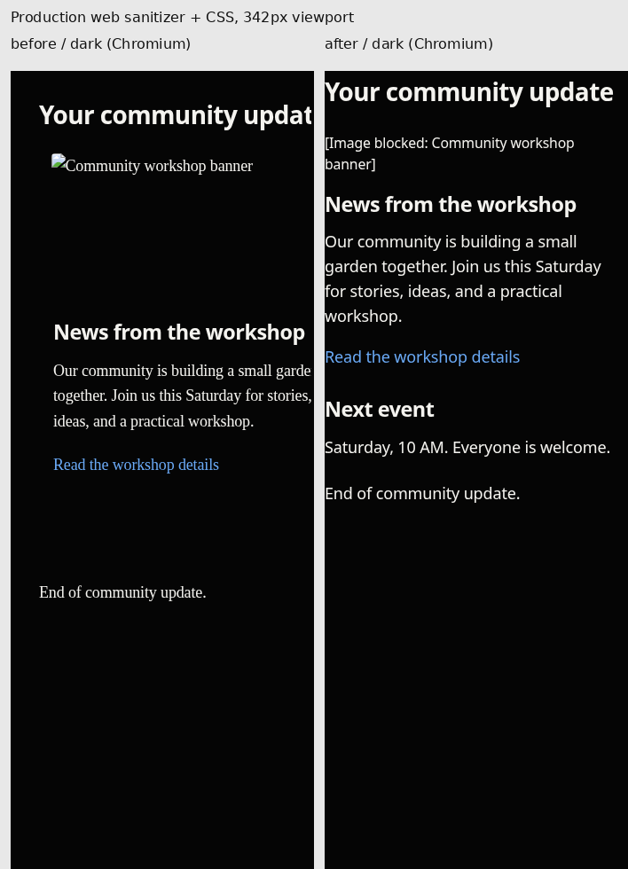

# Readable formatted mobile mail

Goal: a newsletter's story, secondary section and links remain readable without squeezed columns or empty blocked-image rectangles. Formatted/text switching retains the existing controls and original message source. No Inbox/Focus ordering changes.

## Change and safety boundary

- New inbound-only presentation transform runs at thread-detail serialization. Stored HTML, MIME text and outbound sanitizer are unchanged.
- Only explicit presentation/none tables without their own data headers, captions, row/column spans are normalized. Unknown and data tables remain tables. Sender classes are stripped; renderer markers are generated after sanitization.
- Validated newsletter layouts receive scalable sans type, bounded spacing and stacked mobile cells. Ordinary email keeps existing reader type; code and semantic data tables retain their content.
- All inbound image elements become inert labels (including CID, pending a separate attachment resolver). Decorative unlinked images disappear; image-only links retain a visible label. No tracking URLs reach hidden web HTML. No arbitrary stylesheets, executable elements or resource CSS were added. Native CSP, script disabling and navigation restrictions remain unchanged.
- Missing MIME text gets a structured text fallback with paragraph boundaries, link destinations, table separators and exact preformatted content.
- Inbound nesting is bounded to 128 before DOM parsing/serialization. Text at greater depth remains available. Outbound policy has no new bound or behavior change.

## Evidence and review

`bun apps/web/scripts/check-mobile-email.mjs` runs the actual production sanitizer and web CSS through 96 Chromium cases: two newsletters, data/code, ordinary mail,30-reply content and nested data tables;272/342/390/1024 widths; both themes and reader sizes. Network is intercepted. It produces real before/after screenshots against immutable base 29958f 22 and exact geometry, not mockups. Browser font fallback and body-only scope are stated in its metrics.

At342px the web newsletter table measured 640×683.91px before and 336×515.52px after, with formatted-region scroll width 643→342px. Width and height are separate. The native prototype's earlier2612→447 figure described height and is not a production/native result.

`bun scripts/security/check-mail-html.ts` is an independent 27-case hostile/malformed-HTML browser corpus with JavaScript enabled and no CSP, asserting zero execution, requests, active resource tags/event attributes and byte-identical outbound results against the base policy.

Independent correctness review found a lost accessible target for no-alt linked images; fixed with an inert label and regression. Independent security review found a serializer stack overflow with 20000 nested nodes; fixed with an inbound-only 128-depth guard and retained-text regression. Both reviewers rechecked their fixes with no remaining blocker in their reviewed scope. These are scoped independent reviews, not a formal Codex Security scan (the skill's supporting preflight resource was unavailable).

Hosted `Native Reader Checks` and `Fixture Checks` run the actual iOS WebKit suite on a fresh macOS/Xcode simulator. New native tests cover newsletter and ordinary/long-thread content at 272/342 widths,22/44 requested font sizes and light/dark, including screenshots. One fixture is the exact production sanitizer output, enforced by a TypeScript contract test. CI artifacts are the source of truth for native pass/fail; Chromium results are not native proof.

## Acceptance and limits

- Newsletter copy stays at the selected reader size, layout columns stack, useful image labels and links remain, no remote resources load.
- Data-table headers/caption and code indentation survive; existing intentional web horizontal code scrolling remains.
- Existing web page min-width320px still overflows a272px viewport. Roleless/ambiguous tables and fixed ancestors outside a recognized layout are conservative fallbacks, not claimed repaired.
- Existing mode controls and routing are untouched; full-app hosted reader checks cover their regression surface. New controls are not introduced. Actual Dynamic Type category transitions, VoiceOver and physical-device interaction still need explicit native acceptance beyond direct 22/44px coordinator probes.
- Local initial full suite had two App.interaction reader-refresh timing failures; one reproduced identically on untouched base29958f22; do not change unrelated Inbox/Focus logic to mask this. Hosted CI remains authoritative. Final PR description records current test/CI results and exact reviewed head.

No merge or deployment is authorized. This is a draft review candidate until the native checks and readability review are accepted.

