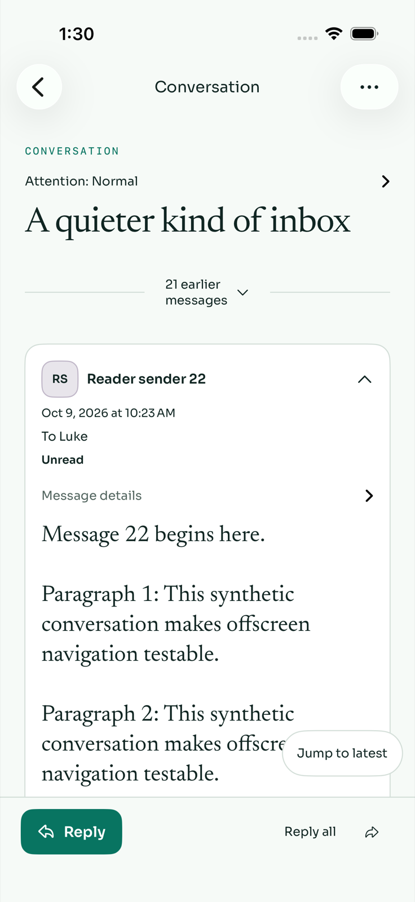
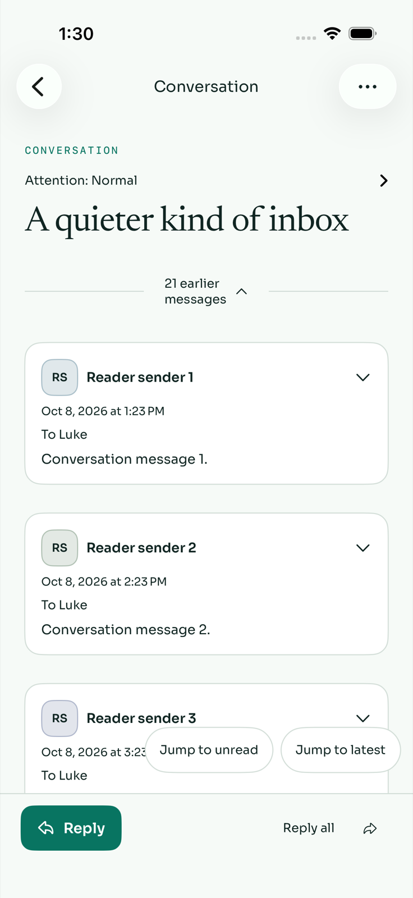
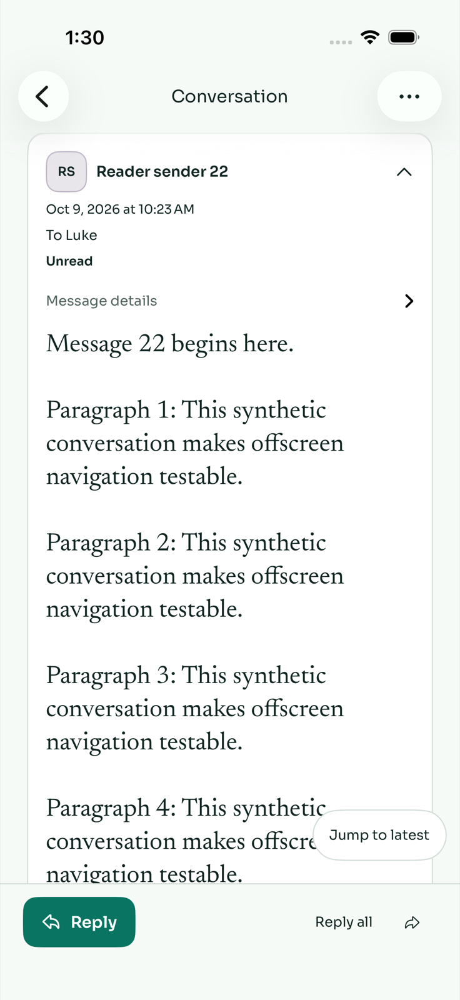
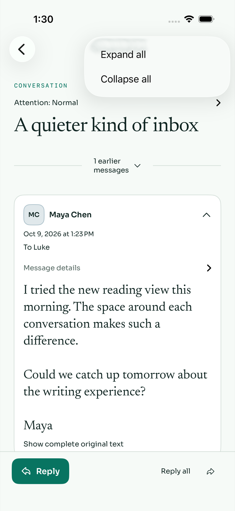
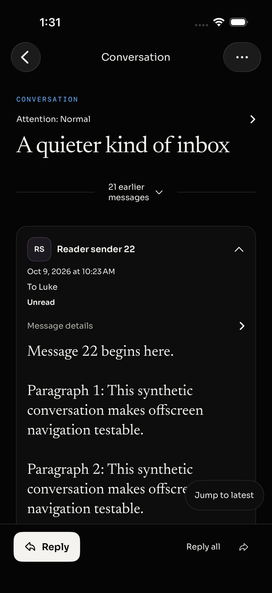
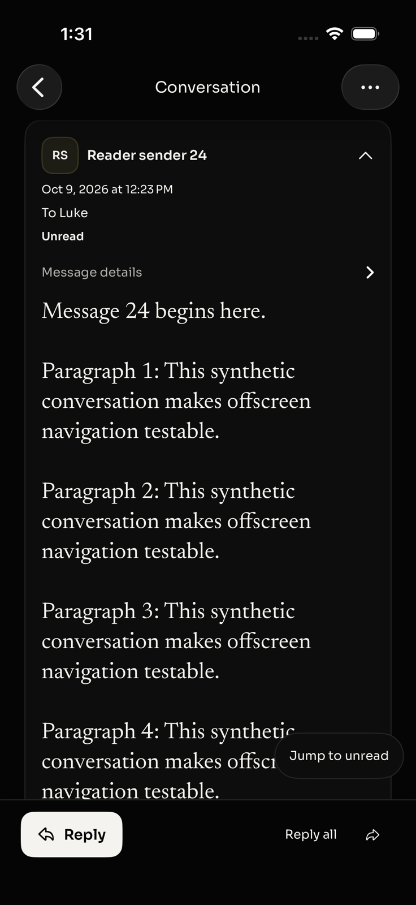
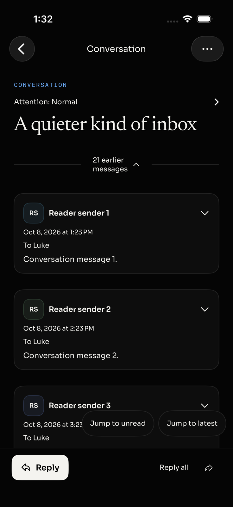
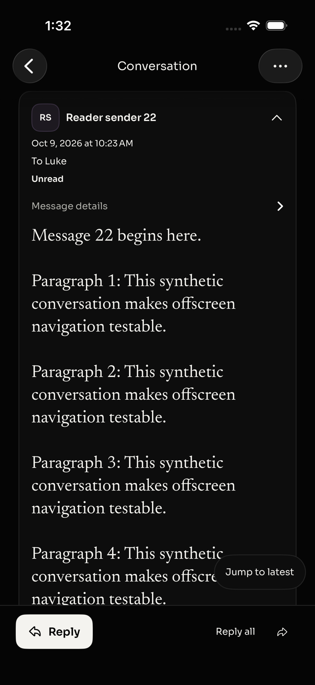
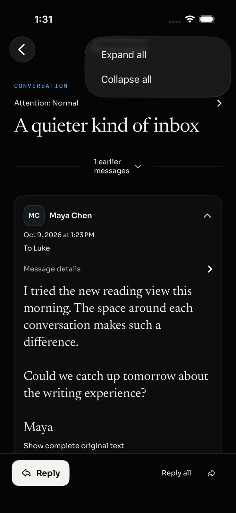

# Native contextual navigation regression

Only synthetic mail was used, on the task-owned iOS 26.4.1 simulator. No live mailbox, signing, release, or runtime installation was involved.

## Reproduction and cause

At baseline `f6a0d3b63188dbb2f5917d72b56d5b19d3fcf7cf`, a 24-message thread opens at unread message 22 while messages 23–24 are below its expanded body. The new native UI regression fails because `thread.jump-latest` is absent.

Temporary geometry instrumentation recorded viewport height 0, content offset 0, one measured card, and an empty visible-card set. The zero viewport suppresses the entire contextual-control overlay. After fixing viewport measurement alone, Jump to latest works; at message 24 the viewport reads 648 points and the visible-card set correctly contains message 24, but content offset still reads 0, suppressing Jump to unread.

Both scalar measurements now use direct geometry observations. Card-frame tracking, the visibility rule, quiet-control design, and content rendering are unchanged. The measured content offset after jumping to message 24 becomes −2384.33 points, and the complete regression passes. All temporary instrumentation has been removed.

## Regression coverage

`test37LongConversationOffersOffscreenUnreadAndLatestJumps` checks:

- First-unread entry at message 22; latest control visible and unread control absent.
- Jump to message 24; latest control disappears and unread control appears.
- Return to message 22; unread control disappears and latest control returns.
- Reveal 21 earlier cards; both targets are offscreen and both controls appear.
- Return to unread, manually scroll into earlier history, then return to unread again.

The authenticated fixture control is loopback-only, delegates detail authorization to the API, overrides only a disposable synthetic thread response, and resets in teardown. The native reading CI scope runs this test in both appearances.

Independent static review found no blocking issues. The installed SDK marks the single-value `onGeometryChange` overload available from iOS 16, compatible with the app's iOS 17 minimum.

## Final local verification

Source: `3456efb3c95e09dfe483962e6c6d460c6627d040`. Unsigned build-for-testing succeeded. The geometry unit regression and test07/test37 passed in light appearance; test07/test37 passed in dark appearance. Fresh screenshots were exported from those successful XCTest runs and visually inspected. The owned simulator was shut down after capture.

### Light appearance

### Dark appearance

